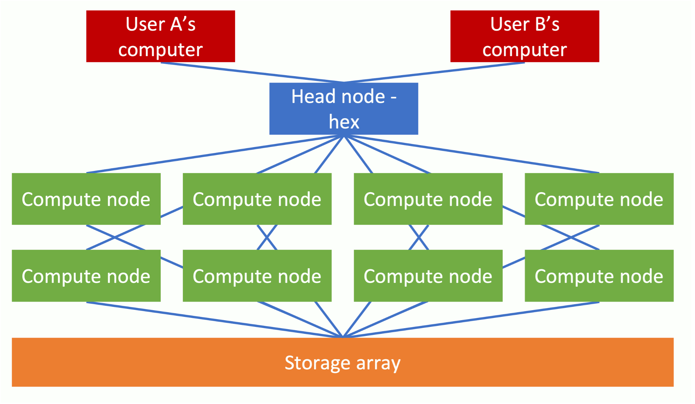
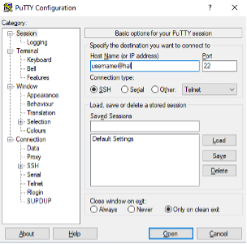
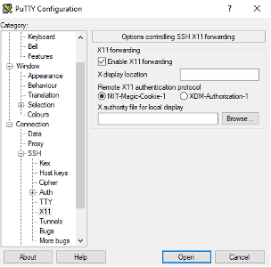
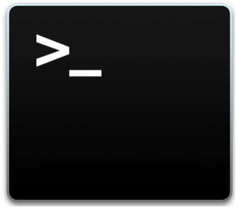
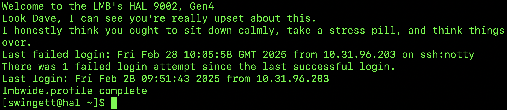
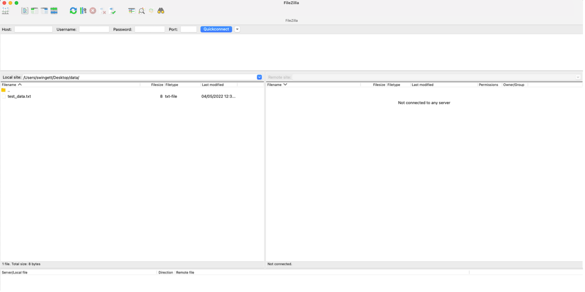

# Course: Running Bioinformatics Software on a Linux Computer Cluster

## Licence
This manual is © 2025, Steven Wingett

This manual is distributed under the creative commons Attribution-Non-Commercial-Share Alike 2.0 licence. This means that you are free:

to copy, distribute, display, and perform the work

to make derivative works

Under the following conditions:

Attribution. You must give the original author credit.

Non-Commercial. You may not use this work for commercial purposes.

Share Alike. If you alter, transform, or build upon this work, you may distribute the resulting work only under a licence identical to this one.

Please note that:

For any reuse or distribution, you must make clear to others the licence terms of this work.
Any of these conditions can be waived if you get permission from the copyright holder.
Nothing in this license impairs or restricts the author's moral rights.

Full details of this licence can be found at 
http://creativecommons.org/licenses/by-nc-sa/2.0/uk/legalcode

# Introduction
## Aims
This course is intended for people who are starting bioinformatic analysis on Linux systems.  The course teaches what Linux systems are and how to run bioinformatics tools in such environments.  The course also gives an overview of running software on computer clusters.

While the course content is tailored to the setup at the LMB, much of the concepts and methods can be applied to other computational infrastructure.

## Assumed prior knowledge
The course is aimed at the absolute beginner and assumes no prior knowledge, except that expected of a wet-lab molecular biologist – such as familiarity with RNA-seq, ChIP-seq etc.  No advanced computing skills are required, but participants are expected to be able to use everyday software on a modern desktop or laptop computer.

## Content overview
The course has five parts.  The first introduces the concept of a “compute cluster” and then describes the set-up at the LMB, providing details on how to access the machine.  The next part introduces the Linux command line interface, which is the method by which users interact and control the cluster.  This is by no means an exhaustive or even particularly detailed description of using Linux, but it does introduce the key concepts you need to know for working on the cluster.  The third part gives an overview of Next Generation Sequencing, while the fourth part explains how to run jobs that make optimal use of a compute cluster.  The final part goes over how to run NGS pipelines at the LMB using the Nextflow pipelining system. It focusses on the initial bioinformatics processing of raw data generated by sequencers.  This typically involves launching a pipeline to perform quality control on the data and map reads to a reference genome, followed by quantitating and summarising the results (e.g. a matrix of genes quantitated for RNA expression).  Although this is by no means the endpoint of NGS analysis, participants completing this course will learn how to convert seemingly unintelligible data to a point which is ready for bespoke investigation.

Prerequisites – please action these points in plenty of time BEFORE the course
Obtain a cluster account
You will need to be registered to gain access to the cluster, so please make sure you have an account.  

To do this, complete the online form, which is found on the intranet at:
https://bb8.mrc-lmb.cam.ac.uk/userdash/slurm.cgi

Please fill out this form in plenty of time **before** the course.

Software
Attendees will need to bring their own laptops to the course, which should be running a recent version of Windows or macOS.   Please install recent versions of the following software before attending the course:

Windows systems:
FileZilla Client - https://filezilla-project.org/
Putty: https://www.chiark.greenend.org.uk/~sgtatham/putty/latest.html

macOS:
FileZilla Client - https://filezilla-project.org/

Network Access
Please make sure you bring a machine that can already connect to the LMB intranet via wi-fi (not the Guest network). If you can view the following page using wi-fi then you have access: https://bb8.mrc-lmb.cam.ac.uk/userdash/slurm.cgi

# Cluster Computing
# What is a compute (or computer) cluster?
A compute cluster is a set of computers that work together so that they can be regarded as a single entity. These inter-connected computers (known as nodes) run software to coordinate the running of programs across the system.  The diagram below gives an overview of a compute cluster. 

 
Figure 1 - Compute cluster schematic

This setup enables the processing of data simultaneously across multiple nodes to speed up running times.  The LMB has a particularly powerful computing cluster comprising (at the time of writing) 130 CPU nodes with 112 hyperthreaded cores.  Each of these nodes has access to 754GB of RAM.  What this means is that the cluster may theoretically perform 130 x 112 = 14,560 processes simultaneously.  This is significant, for the extent to which a job may be subdivided and parallelised will greatly reduce the required processing time.  In practice, for the sake of fairness to everyone, a single user will not be able to use all the allotted nodes at once, but nevertheless taking advantage of the parallelisation capabilities of a computer cluster should substantially reduce processing times.  To put this in perspective, it is typical for a new MacBook Pro to have only 4 cores installed.

Each of these compute nodes is connected to a data storage array.  The key cluster storage areas at the LMB are `cephfs`, `cephfs2` and `scratch` which currently have storage capacities of 3.0 PB, 5.7PB and 1.1 PB respectively.  While this may sound gigantic, maintaining such storage drives is needed to keep parity with the burgeoning data output produced by new life sciences technologies, such as Next Generation Sequencing.

In addition to possessing considerable processing and storage capabilities, compute clusters are preferable to standard setups in that they are not usually turned off and have specialist software for managing the jobs of multiple users and how those jobs are distributed between the compute nodes.

When logging into the cluster, users will connect to one of the three head nodes (hal, hex or max).  The user will then instruct the head node that a job is to be performed.  The intensive computational tasks will not be carried out on a head node itself, but instead the job or jobs will be farmed out to one or more compute nodes.  Job requests are placed in a queue until system resources become available.

(There are other types compute nodes other than CPU nodes installed on the cluster, but we will not be using them in this course.)

## Accessing the Cluster
As mentioned previously, the first thing you need to do is get an account on the compute cluster via an online form:

https://bb8.mrc-lmb.cam.ac.uk/userdash/slurm.cgi

The descriptions below describe how to access the compute cluster when working physically on-site, at the LMB.  For remote access (outside the LMB intranet), you will first need to connect to the atg server – look at the Scientific Computing intranet pages for details on this.

Generally, people will be using PCs running Windows or Macs running macOS.  These different setups require different methods to access the cluster (we assume people running Linux already know how to connect).

### Cluster access via a Windows Machine
Ensure that the software Putty is installed on your computer (it can be downloaded from: https://www.chiark.greenend.org.uk/~sgtatham/putty/latest.html).

Once you open Putty, you should see a window similar to that displayed below.  Enter your cluster username with @hal appended in the Host Name box.  For example, if your username is jsmith, then enter jsmith@hal.  Leave the Port set to 22.  Click Open to access the cluster.

If you would like to view images directly from the cluster, you will need to enable X11 forwarding before connecting.  In the left-hand side pane select Connection -> SSH -> X11 and then check the Enable X11 forwarding box.

### Cluster access using a Mac
Open the terminal window. Do this by double-clicking the terminal icon (a black square with the >_ symbol in the top left corner).  Alternatively, press cmd + space simultaneously and then type terminal in the Spotlight Search bar.

Figure 2 Mac terminal icon

The terminal window should now have opened.  To tell your Mac to connect to the cluster, enter the following command:

    ssh -Y hal

(The `-Y` is not strictly necessary, but it enables the transfer of images.) 

Then enter your cluster password (which should have been sent to you after you registered for cluster access). When you successfully login, a message will be displayed in the terminal window – usually informing you when you last logged in:

## Transferring files to and from the cluster
It is often necessary to upload files to or download files from the LMB cluster to your local machine.  There are several ways to do this, but we recommend using the application FileZilla Client.  It is widely used, distributed as free software and has an intuitive drag and drop interface.  It can be downloaded from https://filezilla-project.org in either a Windows- or macOS-compatible format.

 
On opening the software, you should enter your login credentials in the bar towards the top of the screen.  In addition to your Username and Password, you need to enter the Host - which is hal, and a Port – which is 22.

When you have logged-in you should see your local machine’s filesystem in the left-hand pane and the remote machine’s (i.e. the cluster’s) filesystem in the right-hand pane.  Simply drag and drop icons between the two to move files and folders from one machine to another.