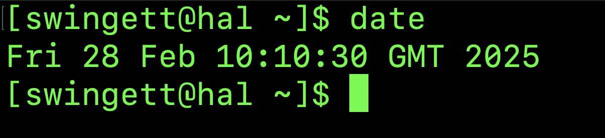
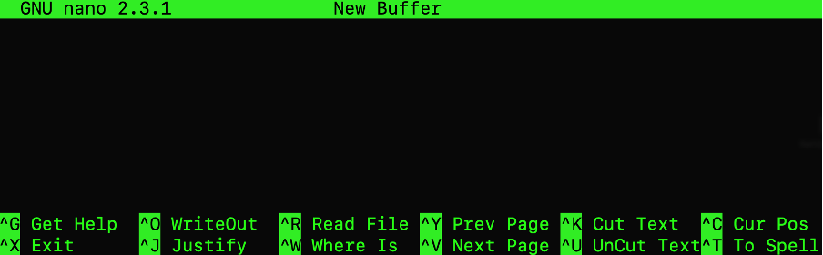
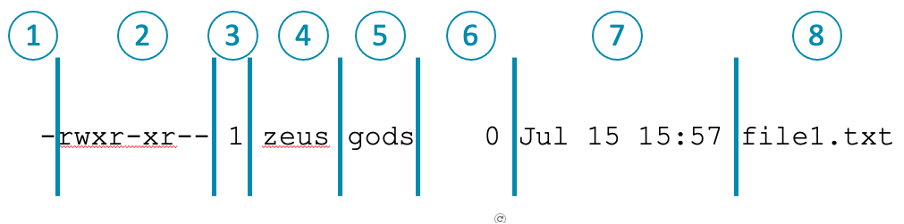

# Course: Running Bioinformatics Software on a Linux Computer Cluster

## Licence
This manual is © 2025, Steven Wingett

This manual is distributed under the creative commons Attribution-Non-Commercial-Share Alike 2.0 licence. This means that you are free:

to copy, distribute, display, and perform the work

to make derivative works

Under the following conditions:

Attribution. You must give the original author credit.

Non-Commercial. You may not use this work for commercial purposes.

Share Alike. If you alter, transform, or build upon this work, you may distribute the resulting work only under a licence identical to this one.

Please note that:

For any reuse or distribution, you must make clear to others the licence terms of this work.
Any of these conditions can be waived if you get permission from the copyright holder.
Nothing in this license impairs or restricts the author's moral rights.

Full details of this licence can be found at 
http://creativecommons.org/licenses/by-nc-sa/2.0/uk/legalcode

# Linux
## Getting to grips with Linux
Unlike Macs (which run macOS) or PCs (which run Windows), our compute cluster runs a Linux operating system.  There are many different distributions of Linux, with each having different strengths.  For example, the well-known operating system Android, optimised for mobile devices, is based on a version of Linux.  The LMB compute cluster now mainly uses **AlmaLinux** (after recently transitioning away from Scientific Linux).  AlmaLinux is open-source and free to use.

This operating system may seem unfamiliar at first, since it does not receive input from the user via a mouse.  Instead, the user types instructions into what is known as the **command line**.  Although this may seem a needlessly complicated and old-fashioned way of doing things, with a little experience a user can achieve complex tasks relatively easily with just a few simple commands.  In fact, despite being a little less intuitive, the command line is actually often a more convenient and powerful way of interacting with a computer, which is why it is favoured by computational biologists and bioinformaticians.  

### Shells
When a user enters a command, it is read by a **command line interpreter**, a type of program known as a **shell**.  A shell therefore allows a user to launch software, but it also provides additional functionality such as keeping a history of commands executed, enabling customised settings to be set up permanently using start-up scripts, as well as providing a simple programming language to automate jobs.  

To quickly check your shell is working, type `date` in the command line and then press Enter.  The current date time should then be displayed.

There are many different shells available, of which **Bash** is arguably the best known.  Unfortunately this is not the default shell used by the cluster and so we advise changing this setting the first time you log in to the cluster.  Once this is set up, you shouldn’t need to change anything again.  Follow the instructions below to set Bash as your default shell.

Check which shell you are currently using:
    
    echo $SHELL

If the output ends with the word bash then you do not need to change the shell.  However, if something else is reported instead (probably “tcsh”), then you will need to **contact Scientific Computing to change your default shell**.  However, you can temporarily run a bash shell inside your current shell by typing:

    bash

This will expire when you next logout.

### Introducing the Linux commands (ls)
When a valid command is interpreted by the shell it will execute a program.  For example, the command `ls` will launch software that lists files and folders (the latter are also known as directories).  The action of a command may be modified by what are termed **flags**, options and arguments.  Below summarises the general structure of a command.

    command [-flag(s)] [-option(s) [value]] [argument(s)]

So, the command ls displays the files and folders in the current working directory (this term will be described in more detail later).

    ls
    directory1  file1.txt  file2.txt  file3.txt

#### Flags
The `ls` command’s operation can be modified with the addition of a flag.  Some flags will be whole words, while others will be single letters.

For example, to obtain more information on the files and folders being listed, use the `-l` flag.

    ls -l
    total 12
    drwxrwxr-x 2 swingett swingett 4096 Jul 15 15:59 directory1
    -rw-rw-r-- 1 swingett swingett    0 Jul 15 15:57 file1.txt
    -rw-rw-r-- 1 swingett swingett   17 Jul 15 16:35 file2.txt
    -rw-rw-r-- 1 swingett swingett   37 Jul 15 16:34 file3.txt

It is also possible to combine multiple flags.  The additional flag `--human-readable` displays file sizes in terms of kilobytes, megabytes, gigabytes etc. to make for easier reading and interpretation.  Notice that the flag using full words is prefixed with 2 hyphens, whereas flags prefixing single characters have one hyphen.

    $ ls -l --human-readable
    total 12K
    drwxrwxr-x 2 swingett swingett 4.0K Jul 15 15:59 directory1
    -rw-rw-r-- 1 swingett swingett    0 Jul 15 15:57 file1.txt
    -rw-rw-r-- 1 swingett swingett   17 Jul 15 16:35 file2.txt
    -rw-rw-r-- 1 swingett swingett   37 Jul 15 16:34 file3.txt

It is possible to abbreviate some flags (when the abbreviation does not create ambiguity). For example, the flag `--human-readable` can be abbreviated to `-h`.  Furthermore, such single-character flags can be combined to reduce typing: `ls -l -h` is equivalent to ls -lh

#### Options 
In contrast, Linux commands may take options which are similar to flags, but take values.

    ls -l --sort=size
    total 12
    drwxrwxr-x 2 swingett swingett 4096 Jul 15 15:59 directory1
    -rw-rw-r-- 1 swingett swingett   37 Jul 15 16:34 file3.txt
    -rw-rw-r-- 1 swingett swingett   17 Jul 15 16:35 file2.txt
    -rw-rw-r-- 1 swingett swingett    0 Jul 15 15:57 file1.txt

#### Arguments
And a command may take values.  Here the command will print only files with the names `file1.txt` and `file.3.txt`.  The values `file2.txt` and `file3.txt` are passed directly to the list command.

    ls -l file2.txt file3.txt
    -rw-rw-r-- 1 swingett swingett 17 Jul 15 16:35 file2.txt
    -rw-rw-r-- 1 swingett swingett 37 Jul 15 16:34 file3.txt

This might seem a little esoteric at the moment, but the take-home message is that commands are passed to the cluster using the command line.  The action of these commands can be modified by flags, values passed to options and/or arguments.

#### Introducing the Linux filesystem
You no doubt are already familiar with the concept of filesystems when using Macs or PCs: computer files typically sit within a directory or within a series of nested directories.  This also applies to Linux systems, where the directory structure is represented using a line of plain text and in which each folder name has a forward slash (`/`) appended.

In the example below, file1.txt resides in a folder named `jsmith`, which in turn is located in a folder named `home`, which is found in a folder named `lmb`.  These nested folder structures can be complex and much longer than this, but the same concept applies.  Also, you should note that at the start of the line of text is a forward slash.  This denotes the root directory, which is the top-most directory in the Linux filesystem hierarchy i.e. all files and folders ultimately sit within the root directory.

    /lmb/home/jsmith/file1.txt

#### Relative vs absolute paths
The path listed above is what is termed as an absolute path, which means it contains the complete file hierarchy listing.  There is in contrast what is known as a relative path that lists the position of a file or folder relative to the current working directory.

Suppose your current working directory was `/lmb/home/jsmith`, and you wished to reference a file at location `/lmb/home/pjones/file2.txt`.  You could use the previous absolute path, but another way would be to use the relative path: `../pjones/file2.txt`.  The 
double dots (`..`) mean go "up one level" in the file system hierarchy. 

Similarly, the single dot (`.`) refers to the current working directory.  Consequently, the path `./file4.txt` references a file in the current working directory.

The symbol tilde (`~`) references the home directory, so `~/folderA/file5.txt` refers to a file which is in `folderA`, which itself is in your Home directory.

You might be wondering why you would choose to use a relative path.  There are two main reasons: firstly, relative pathnames are shorter which saves on typing and reduces the risk of introducing errors.  Secondly, you may not always know the absolute link to a file.  To illustrate the point, suppose you deployed software for public use.  Your software comprises multiple files and those files need to communicate with one another.  But how would this be possible if the software is running on someone else’s computer?  You won’t know in advance the file structure of that device and the location to which your deployed code will be copied.  To get around this you can make use of relative path, in which only a file’s position relative to another is required and not the absolute path.

#### Naming files
The best way to name files is to use only alphanumeric characters, the underscore symbol and the dot. The following filename contains all of these and is acceptable: 

    my_file1.txt

Also, it is **best practice not to use spaces in filenames**, even though people quite happily do this when using Windows and macOS.

By convention, it is also common to give an indication of filetype in the **file extension** – the final dot and following characters.  In the above example the extension is `.txt` which by convention denotes a text file.

You may not be aware, but there are hidden files on a Linux filesystem.  Hidden files begin with a dot, for example:

    .hidden_file.log

These are typically configuration files or log files.  If you run the `ls` command, hidden files will not be returned (hence the term: hidden).  However, you can add the `--all` flag to display hidden files i.e. `ls --all`.

### Using commands to navigate and manipulate the file system
Now that we have introduced Linux commands and the filesystem, we can put them together and navigate around the computer and start making directories and moving files (analogous to what can be achieved with a mouse and pointer when using PCs or Macs).  

We’ve already introduced the `ls` command to list file and folders, but here is a list of some of the other most commonly used commands to move around the filesystem.

`pwd` (print working directory)
This command prints the current working directory of the user.  This might sound a strange concept, but the user can be viewed as having a “location” in the system file structure.  pwd reports back the user’s position.

    pwd
    /lmb/home/swingett

It is possible to move to other locations, as described later.

`cd` (change directory)	
This changes the user’s current working directory. Specify the directory you wish to move to after the command.  The following command changed the current working directory to `data1`:

    cd /lmb/data1

There are several useful shortcuts when moving between directories
Move to previous directory: `cd –`
Move to your home directory: `cd` or `cd ~`
Move “up” a level in the file structure hierarchy `cd ..`

`cp` copy
This command enables the user to copy a file from one location to another.  Below is a simple copy command that copies `file.txt` to a new file named `file_copy.txt`.  (Note that two files sitting in the same folder can’t have the same name, and so the new file needs a different name from the input file.)

    cp file.txt file_copy.txt

In the example below, `file1.txt` is copied to a new folder:

    cp file1.txt /data_folder/file1.txt

It is also possible to copy directories and their contents.  This requires a **recursive** copy using the `-r` flag:

    cp -r directory1/ directory_copy/

`mv` (move)
This allows the user to move files and folders from one location to another.  In the example below the file `file.txt` is moved to the `new_location` folder:

    mv file.txt /lmb/data/new_location

Maybe a little surprisingly, the `mv` command can be used to rename a file:

    mv original_name.txt new_name.txt

`mkdir` (make directory)
To make a new directory or directory use the `mkdir` command.  The command below makes three new directories:

    mkdir new_directory1 new_directory2 new_directory3

`rmdir` (remove directory)
To remove an **empty directory** use the `rmdir` command:

    rmdir directory1 directory2 /data/directory3 

`rm` (remove)
To remove a file or files use the rm command:

    rm file1.txt file2.txt /data/file3.txt

Do this recursively to delete directories that are not empty (along with all of their contents).

    rm -r directory1 directory2 /data/directory3 

Most Linux systems will delete files immediately following a user’s request.  However, to prevent people accidentally deleting files, the cluster has been set up to require keyboard confirmation for every individual file to be deleted.  This can be a time consuming process if many files need to be removed simultaneously.  To stop the system requiring the additional confirmation, append the `-f` flag to the remove command. 

**<u>Warning!</u>
Unlike Windows and MacOS, the command line version of Linux on the cluster does not have a Recycle Bin, which means that once a file has been deleted it is gone forever! So be extra careful when deleting files as it is easy to specify the wrong location and potentially lose many hours of valuable work.**

### Linux tries to help you!
It’s easy to lose track of what you have been doing when typing successive rounds of text into the command line.  However, by typing history you can see a list of the recent commands executed. Alternatively, press the &uarr; or &darr; arrows to navigate through your recent history.

Furthermore, by typing <kbd>CTRL</kbd> + <kbd>R</kbd> and then typing a command of interest, the Bash shell will report the closest matching command from your history.

Also, typing long commands and filenames and file structures can be quite difficult.  Fortunately, the Bash shell comes with a very useful **autocomplete** function which we strongly recommend using, as this is easier for the user, saves time and reduces the risk of typos.  

To use autocomplete, start typing your command and then pressing <kbd>TAB<kbd> or double-pressing <kbd>TAB<kbd> to autocomplete/display suggestions.  This may take a bit of getting used to, so it is worth spending time practising with this feature to get it working optimally.

#### Reading and writing files
In this context we are talking exclusively about text files, or compressed text files.  Linux has a number of simple programs to allow the user to view, write to and edit files.

`cat` (concatenate)
To view the contents of a text file, use the concatenate command.  (The name of this command may not make much sense now, but hopefully will later on). 

    cat file.txt

This is generally fine for smaller files, but for larger files in which dumping a large amount of text to the screen in one go is undesirable, I would recommend using one of the following commands:

`head` Prints out the first 10 lines of a file:

    head file.txt

`tail`
Prints out the last 10 lines of a file:

    tail file.txt

`more` enables the user to scroll through a text file line-by-line or page-by-page.  To open the more viewer type:

    more my_file.txt

Once the file is displayed to the screen, press enter to move through the file one line at a time.  Use the space bar to scroll one page at a time.  Press <kbd>Q</kbd> to exit the more viewer.

Again, there are many flags and options that can be applied to give additional functionality to `more`.  There is also a related program named less which has additional functionality when reading text files.  See which text viewer most suits your needs.

#### The nano text editor
There are many ways to edit a file in Linux.  The operating system is shipped with a text editor called `Vi`, but it is not the most intuitive software for novices and so we recommend using `nano` – already installed on the cluster – which marks a good compromise between wide-ranging functionality, yet is still relatively lightweight and can be run in a terminal window.

Simply type nano on the command line and the software will start and display a screen similar to that shown below.  You can now start writing text in this window and then to save your text simply press <kbd>CTRL</kbd> + <kbd>O</kbd>.  When using `nano`, option menus and prompts will appear at the bottom of the window (please note that the `^` character in a menu denotes the <kbd>CRTL</kbd> button).  

To exit the program type CTRL + X. 

 
To open and view/edit a text file that already exists simply pass the name of the file you wish to open to nano:

    nano file.txt

If you want to create a new, empty file then simply specify the name of this new file when starting nano:

    nano new_file.txt

#### Compressing and uncompressing files
Much of the NGS data that you will process and generate will be in text format.  However, storing data in this way is not very efficient in terms of memory.  When reasonably possible, all large text files should be compressed.  This is most commonly achieved on Linux using gzip:

    gzip file1.txt file2.txt file3.txt
 
This will create files named `file1.txt.gz` etc. (the `.gz` file extension denotes that the file has been compressed).  This gzipping process is related to the zipping, which is commonly performed on Mac and PCs.

To decompress the file, use the `gunzip` command:

    gunzip file1.txt.gz file2.txt.gz file3.txt.gz

##### Viewing Compressed files
It is possible to read the contents of gzipped file without decompressing first.  To do this use the `zcat` command:

    zcat file.txt.gz

As before, this is not ideal for large files, since all the data will be written to the screen in one batch.

`Redirects (> >>)`
Before moving on, we need to introduce pipes and redirects, for these allow commands to be linked together and thus become more versatile.

By default, command output is written to the screen (which is known technically as standard out).  It is possible however to redirect this output to a file.  For example:

    cat file1.txt > file1_copy.txt

Here the contents of file1.txt is read and written to `file1_copy.txt` (which therefore is a copy of the input file).  This might not seem useful at first, since this is essentially the same as running the copy command we encountered earlier.  However, multiple input files may be passed simultaneously to the `cat` command, and thus the contents of these files will be combined in one output file. 

    cat file1.txt file2.txt file3.txt > combined.txt

This process is known as concatenation, which is why this command is named `cat`.

It is also possible to append contents to a file using the double arrow redirect.  The contents of `file4.txt` could therefore be appended to the end of `combined.txt`:

    cat file4.txt >> combined.txt

`Pipe (|)`
The pipe `|` is a way of taking the output from one command and passing it directly to another command.  For example, by piping `zcat` output to the more command, it is possible read directly a gzipped file without decompressing it first

    zcat file.txt.gz | more

This is particularly useful since decompressing a large file can take a considerable amount of time.  If you wanted to just view the first few pages of text then piping `zcat` output to more is a much better alternative.

#### Searching files with `grep`
You are no doubt aware that it is possible to find user-specified words and phrases in text editors (such as Notepad).  Well, it is also possible in Linux using the grep command.  Simply pass your search term and the name of the text file you wish to search to the grep command.  All the lines containing that search term will be returned.

For example, the following will return all the lines of text containing the word “organoid” in the text file thesis.txt.

    grep organoid thesis.txt

As with other Linux commands, the mode of action of grep can be modified using flags, to refine your searching.

#### Getting Help
The command line might feel quite alien to the complete novice, but there are built-in features to help you get to grips with these commands.

1) Execute `whatis` to explain what a command does.  For example, to learn more about the gzip command:

    whatis gzip

2) If you need a complete and official explanation of a command, refer to the built-in manual:

    man gzip

3) The built-in manual is complete and authoritative but can be overly technical for the novice.  There are however plenty of discussion groups online where Linux commands are explained.  Just Google to find one you like.

4) Always have your trusty cheat sheet to hand!

#### Wildcards
For the Linux commands we have been looking at so far, which take filenames as arguments, we have been passing individual or several specific filenames as arguments.  While this is acceptable for a small number of files, it may not always be practicable.  However, Linux makes use of built-in wildcards to make this easier.  A wildcard is a way of symbolically representing characters.

The asterisk symbol `*` matches **none or more characters**.  So, suppose you have text files in a directory that are named after the countries in the UK (i.e. `england.txt`, `northern_ireland.txt`, `scotland.txt`, `wales.txt`).

    ls *land.txt
    england.txt  northern_ireland.txt  scotland.txt

(Matching none might sound like a strange idea, but if you think about it, if this were not the case then look-up terms such as `*england.txt` would fail to match.)

The wildcard question mark `?` matches exactly one character:

    ls wa?es.txt
    wales.txt

The character class is also useful.  It matches any of the single alphanumeric characters in the list:

    ls [es]*.txt
    england.txt  scotland.txt

Be aware that placing non-alphanumeric characters in the list can change its mode of action, so please read up on this if you wish to know more.

#### Links to files
You are probably already familiar with the concept of shortcuts on Windows systems, or aliases on Macs.  This is where we create a link in one location to reference a file somewhere else.  For example, we may have an MS Word document that is buried somewhere on our filesystem, but we would like to be able to access this file directly from the Desktop.  However, we don’t want to move the file itself to the Desktop.  A way to do this is is create a (**shortcut** (or **alias**) to the file of interest.  If the link is accessed, then the target file is opened.

Well, Linux has something similar called a **symbolic link**.  Symbolic links are created with the command:

    ln -s /target_folder/target_file_of_interest.txt

This will create a symbolic link named `target_file_of_interest.txt` in the current working directory.  It is possible to name the link differently from the target file by adding the link name at the end of the command:

    ln -s /target_folder/target_file_of_interest.txt link.txt

It is also possible to link to multiple files in one command by specifying the current work folder (`.`) at the end of the command:

    ln -s /target_folder/*.txt .

#### File permissions
In a previous example which demonstrated the command `ls -l`, the system returned the list of files in the current directory, along with additional information.  This is known as **long format**.

Explanation of long format:

 
Column Number	Description
1	File type (- file / d directory / l link) 
2	Permission string (user / group /everyone)
3	Number of hard links
4	Owner name
5	Owner group
6	File size in bytes
7	Modification time
8	File name

This means that the owner of the file is `zeus`.  The file belongs to the group `gods`.

The permission string explains who can read (`r`), write to (`w`) or execute (`x`) the file.

So, the owner of the file (`zeus`) can:
`rwx` (read, write and execute the file)

Members of the group (`gods`) can:
`r-x` (read, not write to, but can execute the file)

Everyone else can:
`r--` (only read the file)

It is possible to check to which groups which you belong using the command: `groups`.  It is also possible to change the read/write/execute permissions of a file with the command: `chmod`.

#### Variables
Similar to programming languages such as Python and R, the Bash shell allows users to create and read system-defined variables (these stores information in a fashion akin to algebra in which letters are used to represent numbers).  The variable `$USER` stores your username.

#### Other useful commands
##### `echo`
The command echo takes text and prints it to the terminal, or this output can be redirected to files or other commands.  It will also interpret variables.  For example, try:

    echo Hello $USER

Notice that your username is displayed, rather than printing literally “$USER”.

##### `sort`
This command sorts lines of text.

##### `curl`
This command is used for transferring data to and from a server.

##### `dos2unix` / `mac2unix`
This is a useful piece of software to install on a Linux system for there is, unfortunately, an incompatibility between Linux and Windows / Mac systems with regard to how textfile line endings are interpreted.  Consequently, text files generated on Windows / Mac machines may not be processed correctly when running on Linux.  The dos2unix / mac2unix commands correct this discrepancy by modifying such line-endings.  Note: this command edits the input file.

#### Running Jobs
This next section introduces commands that are useful for long-running jobs and gives guidance on how to monitor commands that are running.

##### `$PATH`
To run an executable file, you need to provide the full path (filesystem link) to that file e.g. `/path/to/executable_file.py`.  However, when running software such as `ls` and `cp` (remember these commands are actually programs) you will not have had to provide a full path, for simply the name of the program will suffice.

Why is this?  Well, the folder that contains these programs is specified in the `$PATH` variable.  To see the folders contained in the `$PATH` variable (each individual folder is separated by a colon in the output):

    echo $PATH

Use the which command to find the location of a piece of software found in a PATH folder

    which ls
    /bin/ls

The command will also report if the software is not found in the `$PATH`.  It is common to add external software (i.e. software not part of the Linux distribution) to the path.

##### `ps`
This commands displays information about your current active processes.  This is a good way to see the jobs you have running

##### `top`
This command is similar to ps in that it provides information on running processes, however unlike `ps`, it produces a continually updated display. To exit the display press the key <kbd>q</kbd>.  Also, this command will display all processes currently running, but to display just your jobs type your username:

    top -u $USER

##### `nohup`
Suppose you have started an important and long-running command on your system but then you need to log off which would cause your job to terminate.  This problem can be overcome with `nohup` (meaning no hang-up), which allows your job to keep running, even if you logout.  For example, to apply no hang-up to a copying job:

    `nohup cp -r /path/to/data/ .` 

##### Backgrounding
You may have noticed that once you start a job, you cannot enter anything in the command line until it completes.  This can be overcome by backgrounding the process by appending an ampersand (&) to the command:

    nohup cp -r /path/to/data/ . &

Alternatively, currently running jobs can be stopped with <kbd>CTRL</kbd> + <kbd>Z</kbd>.  The command bg can then be used to background the job.  In contrast, the command fg will move a job from the background to the foreground.

##### `kill`
Suppose you have started a long-running process, but realise you made a mistake and want the process to end.  To do that, look up the process "id" (PID) using `ps` or `top`.  Then end the process (or multiple processes) with the kill command.  The example below ends processes 3101 and 3102:

    kill 3101 3102

Should that fail, you can force a process to terminate by adding the `-9` flag:

    kill -9 3101 3102

The `-9` flag should only be used if the command `kill` fails to terminate the selected processes.  Although the name suggests otherwise, the `kill` command terminates a process gracefully (e.g. ensures data has finished saving etc.).  However, should that not work, the command `kill -9` will close running processes immediately.  (The former is similar to closing a program using the "Close" button on a Windows system, the latter is akin to forcing a program to close with the Windows Task Manager.)

##### `exit`
The exit command is used to end a Linux session.

#### Additional tips
Make use of Linux cheat sheets such as the one distributed with this course.  They are useful to have to hand and serve as an excellent aide-memoire when writing Linux commands.  An example of an introductory Linux cheat sheet can be downloaded from [here](https://github.com/santosh373/Linux-Basics/blob/master/linux%20cheat%20sheet.pdf). 

  If that doesn’t help with a specific task, then searching around on Linux discussion groups or using Google is a good way to find out what you need to know.