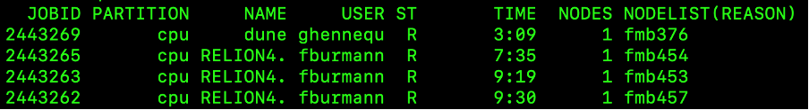

# Course: Running Bioinformatics Software on a Linux Computer Cluster

## Licence
This manual is © 2025, Steven Wingett

This manual is distributed under the creative commons Attribution-Non-Commercial-Share Alike 2.0 licence. This means that you are free:

to copy, distribute, display, and perform the work

to make derivative works

Under the following conditions:

Attribution. You must give the original author credit.

Non-Commercial. You may not use this work for commercial purposes.

Share Alike. If you alter, transform, or build upon this work, you may distribute the resulting work only under a licence identical to this one.

Please note that:

For any reuse or distribution, you must make clear to others the licence terms of this work.
Any of these conditions can be waived if you get permission from the copyright holder.
Nothing in this license impairs or restricts the author's moral rights.

Full details of this licence can be found at 
http://creativecommons.org/licenses/by-nc-sa/2.0/uk/legalcode

 

# Slurm
## Introduction
By this point in the course, you have logged in to a head node and then executed simple commands – essentially you have been treating the compute cluster as one might treat a simple desktop system.  That is fine for demonstration purposes, but the compute cluster architecture is not designed to be used in this fashion, and in by doing so we are not making use of the cluster’s considerable processing power.  The correct way to use a cluster is to log in to a head node and from there pass jobs to compute nodes, where intensive number crunching can be performed.  

Enabling head nodes to communicate with compute nodes and ensuring all these nodes can communicate with storage arrays, while simultaneously allowing different users to interact with the system while keeping track of all the users' jobs as they are passed from node to node is far from trivial.  Fortunately, there are specialist software tools for managing these tasks on computer clusters.  The LMB cluster uses one such workload manager known as **Slurm**.  In this section we shall introduce Slurm and give an overview of how to execute jobs on compute nodes.  

[Bioinformatic pipelines that link software tools in sequential workflows will not be described here, but instead are detailed in the next section that discuses Nextflow and nf-core.]

## Using Slurm
The Slurm files are located on the LMB cluster at `/user/bin/` where the Linux command line programs are also kept.  This means that Slurm commands should already be in your PATH and be ready to use.  We shall now cover the main Slurm commands you will need.

(Further help regarding these commands can be obtained from the Linux manual – `man`.)

### Checking the state of the cluster
#### `squeue`
Earlier in the course we introduced the Linux command `top` which lists the job currently running on the user’s current node.  Well, `squeue` is similar, for it reports the jobs that have been added by Slurm to the scheduling queue.  The command lists both running and pending jobs, as shown in the example below.

Figure 6 - Slurm scheduling queue

The table below explains the different columns.

Column Name	Description
JOBID 	Incrementing numerical IDs for cluster jobs
PARTITION	A partition is a logical division of a hard disk that is treated as a separate unit by operating systems and file systems.  On the LMB Cluster there are cpu, gpu and ml partitions.  The cpu partition is the default and what we shall be using.  The gpu partition is optimised for graphics applications and the ml partition is optimised for machine learning.

| Header   | Description                                |
|----------|--------------------------------------------|       
| NAME     | The name of a submitted job.               |
| USER     | User who submitted the job.                | 
| ST       | Status of the job i.e. how the job is progressing. Common status reports include: PD -job pending and waiting for resource allocation; R - job allocated to a node and running.|
| TIME     | Length of time a job has been running      |
| NODES	   | Number of nodes used for a job             |
| NODELIST | The name of the nodes being used for a job. LMB compute cluster nodes begin with the letters fmg, followed by a numerical value.                                        |

You may wish to view all the jobs running on the cluster, but more frequently you will want to view just your jobs.  To do that, enter on the command line:

    squeue -u $USER

`sqsummary`
This is another useful command that gives a summary of the CPU node state.  It summarises how many CPUs each user is using and the percentage of currently free nodes.

`sinfo`
is used to view partition and node information for a system running Slurm.

`qinfo`
When connected to the LMB intranet, go to the page listed below to view an overview of the current state of the cluster.  The webpage runs the qinfo command and gives a breakdown of all the nodes being used, what jobs are running and which users are running them.
http://nagios2/qinfo/

## Running jobs
We have already stressed that jobs should not be run on a head node directly, since these nodes provide an interface between users and the whole cluster.  If the head nodes become overloaded with intensive tasks, people will no longer be able to interact with the cluster smoothly, or even at all.  

But suppose we want to perform a resource-intensive computation – where would be do this?  Well, it depends on the type of job we want to perform, but generally speaking there are two options open to us:

1) Interactive jobs – run short operations that complete quickly while you wait, check the results and perform another calculation if required

2) Submitted jobs – long-running jobs that do not require user intervention

### Running interactive jobs
To perform interactive jobs we need to move from a head node to a compute node.  Once on a compute node we are free to run Linux commands as before – it’s akin to logging in to a powerful workstation or desktop machine.  To access a compute node, run the command:

    srun --pty bash 

If this has worked correctly you will notice that the command prompt will have changed.  Instead of displaying a prompt of the format `username@hal`, you will see that hal has been replaced by the name of the node to which you have logged on to, e.g. `username@fmb376`.  You can pass commands to the node using the Bash shell.

By default, when you logon to a compute node, you will be allocated 1 CPU core.  It may be that your job will need more than this, but you can reserve the number of CPUs you require in advance.  To specify 8 cores, for example:

    srun -c 8 --pty bash

Type exit to leave the compute node and return to the head node.

### Submitting jobs
Non-interactive jobs are submitted from the head node to the Slurm scheduler using the `sbatch` command.  `sbatch` takes as an argument a script that contains the Bash commands you wish to run.  Shown below is the contents of a simple bash script named test.sh:

    #!/bin/bash
    echo Hello World!

All scripts you write should start with the line: `#!/bin/bash`.  This makes it explicit that this is a Bash script, and lists where the Bash executable is located on the filesystem.

The second line is the command you wish to run, which if you remember from before will print “Hello World!” to the screen.

To execute this Bash script on the head node, type:

    bash test.sh
    Hello World!

(Although we are discussing how to submit jobs to the cluster in this section, it is certainly worth knowing that Bash commands can be written to files in this way and subsequently run.  Doing this can save users a lot of time entering the same commands over-and-over again into the command line.)

So, this has had the same effect as simply entering the echo Hello World! on the command line.  Now, in this example, we pass this script to the `sbatch` command to submit the job to a compute node.

    sbatch test.sh 
    Submitted batch job 2444919

The number of the batch job is unique and is incremented every time a user on the cluster submits a job.

You will notice a file has now been created which contains this job number: `slurm-2444919.out`.  This file contains the text output that would have been written to the screen if the Bash command had been run directly and not submitted to `sbatch`.

So, that is how we submit jobs to the cluster: 
1) create a Bash script of the command(s) to execute
2) submit those command(s) to compute node(s) using `sbatch`

There are a few extra options that should be considered when submitting jobs using `sbatch`:

| Command Flag         | Function                                 |
-----------------------|------------------------------------------|
| -J [jobname]         | specify an easily identifiable jobname   |
| -c [number of cores] | number of cores on a node to reserve for the job [default: 1]                                              |
|--mem=[RAM]G          | GB of RAM to reserve for the job [default: 5]                                                      |
| --mail-type=ALL      | send email updates on the job’s progress |
| --mail-user=$USER@mrc-lmb.cam.ac.uk | recipient’s email address |

So, you could re-submit the command with these options:

    sbatch -J test_job -c 2 --mail-type=ALL --mail-user=$USER@mrc-lmb.cam.ac.uk --mem=2G test.sh

This will submit the job as before but request 2 cores and 2G of RAM and send status update emails to the user as the job progresses.

This command is long, but it is possible to set up an alias in your `~/.bashrc` configuration file so you don’t need to type it out in full every time.  We shan’t discuss this here in more detail, but please let us know if you would like more assistance with this.

This leads to the question: what are appropriate amounts of memory and CPUs to request?  Well, this is not a straight-forward question to answer.  Some jobs are clearly more memory intensive that others, but quantifying that in advance is not easy to do.  Under reserve the memory allocation or CPUs and the job may crash or take an inordinate amount of time to finish.  In contrast: request too much and you will be denying other users valuable compute resources.  Moreover, the workload management on the cluster is such that a job requiring a large amount of compute resources may wait much longer in the queue before processing even starts.  So, paradoxically, requesting a large amount of resources can lead to a job taking longer to complete!

Perhaps the simplest and most convenient way to make these calculations is to check the resources used by already completed jobs and use that as a benchmark for the future.  Obtaining these metrics on already completed jobs can be achieved with the `sacct` command.

### A note on exit codes
At various points when using the cluster, you may see the term exit code reported.  What does this mean?  Well, when a job finishes it will be assigned an exit code which reports whether a job completed successfully or whether there was some kind of error.  To assist with debugging, different classes of errors are usually assigned different exit codes.  But all you need to know is that an exit code of 0 means the job completed successfully, while any other exit code denotes some kind of error. 

#### `sacct`
The sacct command provides information on the resources used when running a job.  It takes as input the job id (which is included in the the Slurm `*.out` filename).  

    sacct -j [job id]

To get the maximum memory usage:
    sacct --format=jobID%20,CPUTime,MaxRSS -j [job id]

#### `scancel`
To kill running jobs use scancel:

    scancel [job id]

### Loading modules
It is quite common for a user to require a particular version of an application for performing analysis.  Selecting the version of the software you require has been made simple with the `module` command.

To list available modules:
    
    module avail

To use install a module:

    module load [module name]

### Viewing images
It is possible to share graphics between the cluster and your local machine.  On a Mac you will need to have the program XQuartz (https://www.xquartz.org/) running.  On a Windows system you should install and run Windows X-server software e.g. VcXsrv (https://sourceforge.net/projects/vcxsrv/).  

While it is nice to visualise images on your local computer in this way, you will probably notice that interacting with such images is not as smooth as you would typically expect.  An alternative approach is to transfer files (e.g. using FileZilla) from the cluster to your local machine for viewing purposes.

This section introduced the key concepts of using Slurm on the LMB cluster, but for more details please view the Scientific Computing page at: 
https://www.mrc-lmb.cam.ac.uk/scicomp/index.php?id=computer-cluster 