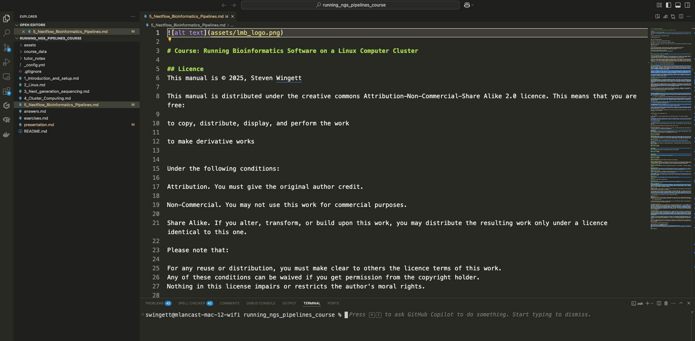
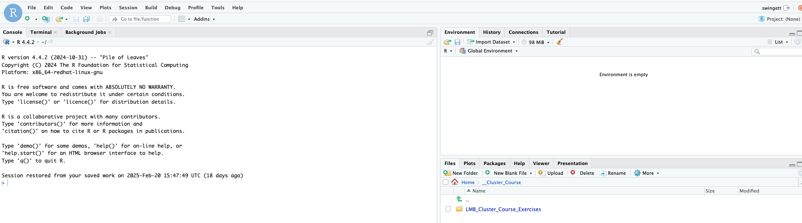
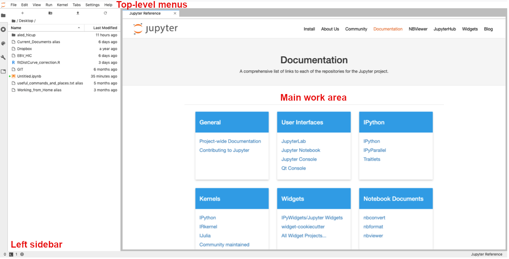

# Course: Running Bioinformatics Software on a Linux Computer Cluster

## Licence
This manual is © 2025, Steven Wingett

This manual is distributed under the creative commons Attribution-Non-Commercial-Share Alike 2.0 licence. This means that you are free:

to copy, distribute, display, and perform the work

to make derivative works

Under the following conditions:

Attribution. You must give the original author credit.

Non-Commercial. You may not use this work for commercial purposes.

Share Alike. If you alter, transform, or build upon this work, you may distribute the resulting work only under a licence identical to this one.

Please note that:

For any reuse or distribution, you must make clear to others the licence terms of this work.
Any of these conditions can be waived if you get permission from the copyright holder.
Nothing in this license impairs or restricts the author's moral rights.

Full details of this licence can be found at 
http://creativecommons.org/licenses/by-nc-sa/2.0/uk/legalcode

 

# Slurm
## Introduction
By this point in the course, you have logged in to a head node and then executed simple commands – essentially you have been treating the compute cluster as one might treat a simple desktop system.  That is fine for demonstration purposes, but the compute cluster architecture is not designed to be used in this fashion, and in by doing so we are not making use of the cluster’s considerable processing power.  The correct way to use a cluster is to log in to a head node and from there pass jobs to compute nodes, where intensive number crunching can be performed.  

Enabling head nodes to communicate with compute nodes and ensuring all these nodes can communicate with storage arrays, while simultaneously allowing different users to interact with the system while keeping track of all the users' jobs as they are passed from node to node is far from trivial.  Fortunately, there are specialist software tools for managing these tasks on computer clusters.  The LMB cluster uses one such workload manager known as **Slurm**.  In this section we shall introduce Slurm and give an overview of how to execute jobs on compute nodes.  

[Bioinformatic pipelines that link software tools in sequential workflows will not be described here, but instead are detailed in the next section that discuses Nextflow and nf-core.]

## Using Slurm
The Slurm files are located on the LMB cluster at `/user/bin/` where the Linux command line programs are also kept.  This means that Slurm commands should already be in your PATH and be ready to use.  We shall now cover the main Slurm commands you will need.

(Further help regarding these commands can be obtained from the Linux manual – `man`.)

### Checking the state of the cluster
#### `squeue`
Earlier in the course we introduced the Linux command `top` which lists the job currently running on the user’s current node.  Well, `squeue` is similar, for it reports the jobs that have been added by Slurm to the scheduling queue.  The command lists both running and pending jobs, as shown in the example below.

Figure 6 - Slurm scheduling queue

The table below explains the different columns.

| Header    | Description                                |
|-----------|--------------------------------------------|  
| JOBID     | Incrementing numerical IDs for cluster jobs |
| PARTITION | A partition is a logical division of a hard disk that is treated as a separate unit by operating systems and file systems.  On the LMB Cluster there are cpu, gpu and ml partitions.  The cpu partition is the default and what we shall be using.  The gpu partition is optimised for graphics applications and the ml partition is optimised for machine learning.
| NAME     | The name of a submitted job.               |
| USER     | User who submitted the job.                | 
| ST       | Status of the job i.e. how the job is progressing. Common status reports include: PD -job pending and waiting for resource allocation; R - job allocated to a node and running.|
| TIME     | Length of time a job has been running      |
| NODES	   | Number of nodes used for a job             |
| NODELIST | The name of the nodes being used for a job. LMB compute cluster nodes begin with the letters fmg, followed by a numerical value.                                        |

You may wish to view all the jobs running on the cluster, but more frequently you will want to view just your jobs.  To do that, enter on the command line:

    squeue -u $USER

`sqsummary`
This is another useful command that gives a summary of the CPU node state.  It summarises how many CPUs each user is using and the percentage of currently free nodes.

`sinfo`
is used to view partition and node information for a system running Slurm.

`qinfo`
When connected to the LMB intranet, go to the page listed below to view an overview of the current state of the cluster.  The webpage runs the qinfo command and gives a breakdown of all the nodes being used, what jobs are running and which users are running them.
http://nagios2/qinfo/

## Running jobs
We have already stressed that jobs should not be run on a head node directly, since these nodes provide an interface between users and the whole cluster.  If the head nodes become overloaded with intensive tasks, people will no longer be able to interact with the cluster smoothly, or even at all.  

But suppose we want to perform a resource-intensive computation – where would be do this?  Well, it depends on the type of job we want to perform, but generally speaking there are two options open to us:

1) Interactive jobs – run short operations that complete quickly while you wait, check the results and perform another calculation if required

2) Submitted jobs – long-running jobs that do not require user intervention

### Running interactive jobs
To perform interactive jobs we need to move from a head node to a compute node.  Once on a compute node we are free to run Linux commands as before – it’s akin to logging in to a powerful workstation or desktop machine.  To access a compute node, run the command:

    srun --pty bash 

If this has worked correctly you will notice that the command prompt will have changed.  Instead of displaying a prompt of the format `username@hal`, you will see that hal has been replaced by the name of the node to which you have logged on to, e.g. `username@fmb376`.  You can pass commands to the node using the Bash shell.

By default, when you logon to a compute node, you will be allocated 1 CPU core.  It may be that your job will need more than this, but you can reserve the number of CPUs you require in advance.  To specify 8 cores, for example:

    srun -c 8 --pty bash

Type exit to leave the compute node and return to the head node.

### Submitting jobs
Non-interactive jobs are submitted from the head node to the Slurm scheduler using the `sbatch` command.  `sbatch` takes as an argument a script that contains the Bash commands you wish to run.  Shown below is the contents of a simple bash script named test.sh:

    #!/bin/bash
    echo Hello World!

All scripts you write should start with the line: `#!/bin/bash`.  This makes it explicit that this is a Bash script, and lists where the Bash executable is located on the filesystem.

The second line is the command you wish to run, which if you remember from before will print “Hello World!” to the screen.

To execute this Bash script on the head node, type:

    bash test.sh
    Hello World!

(Although we are discussing how to submit jobs to the cluster in this section, it is certainly worth knowing that Bash commands can be written to files in this way and subsequently run.  Doing this can save users a lot of time entering the same commands over-and-over again into the command line.)

So, this has had the same effect as simply entering the echo Hello World! on the command line.  Now, in this example, we pass this script to the `sbatch` command to submit the job to a compute node.

    sbatch test.sh 
    Submitted batch job 2444919

The number of the batch job is unique and is incremented every time a user on the cluster submits a job.

You will notice a file has now been created which contains this job number: `slurm-2444919.out`.  This file contains the text output that would have been written to the screen if the Bash command had been run directly and not submitted to `sbatch`.

So, that is how we submit jobs to the cluster: 
1) create a Bash script of the command(s) to execute
2) submit those command(s) to compute node(s) using `sbatch`

There are a few extra options that should be considered when submitting jobs using `sbatch`:

| Command Flag         | Function                                 |
-----------------------|------------------------------------------|
| -J [jobname]         | specify an easily identifiable jobname   |
| -c [number of cores] | number of cores on a node to reserve for the job [default: 1]                                              |
|--mem=[RAM]G          | GB of RAM to reserve for the job [default: 5]                                                      |
| --mail-type=ALL      | send email updates on the job’s progress |
| --mail-user=$USER@mrc-lmb.cam.ac.uk | recipient’s email address |

So, you could re-submit the command with these options:

    sbatch -J test_job -c 2 --mail-type=ALL --mail-user=$USER@mrc-lmb.cam.ac.uk --mem=2G test.sh

This will submit the job as before but request 2 cores and 2G of RAM and send status update emails to the user as the job progresses.

This command is long, but it is possible to set up an alias in your `~/.bashrc` configuration file so you don’t need to type it out in full every time.  We shan’t discuss this here in more detail, but please let us know if you would like more assistance with this.

This leads to the question: what are appropriate amounts of memory and CPUs to request?  Well, this is not a straight-forward question to answer.  Some jobs are clearly more memory intensive that others, but quantifying that in advance is not easy to do.  Under reserve the memory allocation or CPUs and the job may crash or take an inordinate amount of time to finish.  In contrast: request too much and you will be denying other users valuable compute resources.  Moreover, the workload management on the cluster is such that a job requiring a large amount of compute resources may wait much longer in the queue before processing even starts.  So, paradoxically, requesting a large amount of resources can lead to a job taking longer to complete!

Perhaps the simplest and most convenient way to make these calculations is to check the resources used by already completed jobs and use that as a benchmark for the future.  Obtaining these metrics on already completed jobs can be achieved with the `sacct` command.

### A note on exit codes
At various points when using the cluster, you may see the term exit code reported.  What does this mean?  Well, when a job finishes it will be assigned an exit code which reports whether a job completed successfully or whether there was some kind of error.  To assist with debugging, different classes of errors are usually assigned different exit codes.  But all you need to know is that an exit code of 0 means the job completed successfully, while any other exit code denotes some kind of error. 

#### `sacct`
The sacct command provides information on the resources used when running a job.  It takes as input the job id (which is included in the the Slurm `*.out` filename).  

    sacct -j [job id]

To get the maximum memory usage:

    sacct --format=jobID%20,CPUTime,MaxRSS -j [job id]

#### `scancel`
To kill running jobs use scancel:

    scancel [job id]

## Loading modules
It is quite common for a user to require a particular version of an application for performing analysis.  Selecting the version of the software you require has been made simple with the `module` command.

To list available modules:
    
    module avail

To use install a module:

    module load [module name]

## Viewing images
It is possible to share graphics between the cluster and your local machine.  On a Mac you will need to have the program XQuartz (https://www.xquartz.org/) running.  On a Windows system you should install and run Windows X-server software e.g. VcXsrv (https://sourceforge.net/projects/vcxsrv/).  

While it is nice to visualise images on your local computer in this way, you will probably notice that interacting with such images is not as smooth as you would typically expect.  An alternative approach is to transfer files (e.g. using FileZilla) from the cluster to your local machine for viewing purposes.

## Where to store data
There are 5 main areas where people can store files on the cluster

1. `~` (home directory) - your data allocation here is relatively small.  We recommend only storing configuration files and scripts here.

2. `/cephfs` - very large data storage (2.9PB - total for all users). A suitable location for processing data.

3. `/cephfs2` - very large data storage (5.7PB - total for all users). A suitable location for processing data.

4. `/scratch` - very large data storage (1.1PB - total for all users). A suitable location for processing data.  Please note: **FILES ARE AUTOMATICALLY DELETED FROM HERE AFTER A SET PERIOD OF TIME - DON'T STORE FILES HERE!**  Process data here and then copy the results to another location.

5. `/istore` or `/isilon` - a place to store data

**PLEASE REFER TO IT/SCIENTIFIC COMPUTING FOR GUIDANCE ON WHERE TO STORE DATA SAFELY.**

*Do you have sequencing data?  The Cell Biology Division has a dedicated storage location for FASTQ sequencing files.  Please let us know if you wish to deposit data here.*

### Checking current storage
Although drives on the cluster have massive storage capacities, they can fill up!  When approaching capacity (>90% full) some software may fail when running.  To check how full a partition is, run the command:

    df -H | grep [drive name]

**Your current usage can be checked at:**
**https://bb8.mrc-lmb.cam.ac.uk/userdash/userdash.cgi**

For more details on storage locations, please refer to Scientific Computing:
https://www.mrc-lmb.cam.ac.uk/scicomp-new/index.php?id=data-storage

The Scientific Computing webpages also provide instructions on how to create a folder for yourself in `/cephs` etc.

## Transferring files to and from the cluster
This section could have been included in the part of the course that introduces Linux.  However, we decided to include it here, after first discussing where files should be stored on the cluster.  The commands mentioned here are applicable to the Cell Biology Workstation and other Linux set-ups.

You may remember that in the Linux part of this course we introduced `curl` and `wget` as ways to download files from remote web pages.  Well there are also ways to copy files from one system to another using specialist commands.

### Copying files between systems on the intranet
The best way to copy a file from the cluster to another machine (or vice versa) is by using the `scp` (Secure Copy Protocol) command. 

Download a copy a from a remote machine to a local machine:
        
    scp user@host:[target_to_download] [destination_path]  

Upload a copy from a local machine to a remote machine:
    
    scp [target_to_upload] user@host:[destination_path]

Perform a **recursive copy** if you need to copy folders and the contents of folder:

    scp -r user@host:[target_to_download] [destination_path]

    scp -r [target_to_upload] user@host:[destination_path]

### Copying files between systems outside the intranet
#### SFTP
To copy files to and from external locations we suggest you use **SFTP** (Secure File Transfer Protocol).  If that is not possible, then use the less secure **FTP** (File Transfer Protocol).  [As you may have noticed, we introduced FTP/SFTP previously in the course when discussing FileZilla.  Indeed, FileZilla what is known as an FTP client - specialist software for performing such file transfers.  Well, Linux has its own command line equivalents, which are summarised below.]

To connect to a remote SFTP server, enter the command:

    sftp [hostname]

Then, when prompted, provide your password.  When connected you can view files on the remote server with `ls` command, and change directories with the `cd` command.

To download files/folders recursively:

    mget -r [files_to_download]

To upload files/folders recursively:

    mput -r [files_to_download]

#### FTP
To copy files using FTP is much the same process:

    ftp [hostname]

Before starting the transfer we **strongly recommend** that you ensure that the transfer is taking place in **binary** mode - otherwise the file will appear to be copied, but the data may be corrupted!  To do this, enter the command `bin`.  Also, we recommend turning off the FTP prompts with the command `prompt`.  If this is not turned off, the FTP client will seek confirmation for every file transfer - which could become annoying!

#### LMB FTP
If you wish to share files outside the LMB via FTP, then create a folder in `/ftp/pub/` - you may need to contact Scientific Computing to do that.  Then copy your files to that location.  Users outside the LMB will then be able to download the files using FTP.

The address you need is: `ftp.mrc-lmb.cam.ac.uk`, and use a login of 'anonymous', and no password is required. The user will see a file structure that begins with `/pub`, within which are the LMB staff directories.

**Remember that anyone can access data you place on the LMB's FTP server**

For more details, go to:
https://www.mrc-lmb.cam.ac.uk/scicomp/index.php?id=anonymous-ftp

### Perform long-running jobs using `screen`
We discussed previously in the course how to run command after disconnecting from the terminal using `nohup` or `sbatch`.  Sometimes however, these options are not applicable, if additional user input is required.  This is the case when performing FTP/SFTP commands.

To overcome this obstacle, run the `screen` command.  A screen is akin to creating a separate Linux session that will remain running even when you disconnect.  You may create multiple concurrent screen sessions and consequently we recommend that you give an easy-to-remember name to each one.

To create a new, named screen session:

    screen -S [screen_name]

Then you will enter the screen session.  To leave a screen session, but keep it running in the background, type <kbd>CTRL</kbd> + <kbd>A</kbd> and then press <kbd>D</kbd>.

To return to session, firstly list all your existing screens sessions:

    screen -ls

Identify the ID number of your session, and then enter:

    screen -r [ID_number]

To leave and close a screen, type `exit` from within the screen session.

## Visual Studio Code
If you find yourself using the cluster more and more, it may be worth your while to take some time to become familiar with versatile text editors, such as Visual Studio Code (commonly referred to as VS Code).  This piece of software is produced by Microsoft but is distributed for Windows, Mac and Linux systems for free. 

Visual Studio Code allows users to connect to the cluster (even from outside the intranet via atg) to edit and view files.  It can also be used to transfer files between the cluster and your local machine.  It also has its own terminal window, for executing commands.

The software can be downloaded from:
https://code.visualstudio.com/

## R Studio Server
It is possible to run R Studio on the cluster via a web interface.  Open your internet browser (e.g. Google Chrome) and then go to:

    http://hal:8788

Log-in using your cluster credentials.

Alternatively, it is possible to run R Studio on the Cell Biology Workstation (Xeon) by navigating to:

    http://sean-pc-10.lmb.internal:8787

Log-in using your Cell Biology Xeon credentials.

## Jupyter Hub Server
The **Jupyter Notebook** is an intuitive web-based application that scores in the area of research science, for it allows programmers to create and share documents that contain live code, equations, plots and formatted descriptive text.

At present there is no support for Jupyter on the LMB Cluster, but JupyterHub server is installed on the Cell Biology Workstation (Xeon).  Please let us know if you wish to use JupyterHub on the workstation and we will set you up with an account.

We run a course, which is free to all LMB staff and researchers, teaching how to use JupyterHub.  If you would like to know more about this software then we suggest you sign up at the next opportunity, but in the meantime please feel free to look at the course materials, which are available online at: https://github.com/StevenWingett/data-analysis-with-python-course

## Software locations 
Numerous bioinformatics executable files have been deposited at:
`/public/genomics/soft/bin`.  Please take a look here to see if the bioinformatics software you need is already installed.  It might be worth your time to add this location to your `PATH` by editing your `.bashrc` configuration file.  

While anyone is free to run software stored here, you need to be a member of the `software` group to place files in this folder.

## Singularity containers
[Singularity](https://apptainer.org) containers enable software and its dependencies to be bundled into one file.  Containers have gained popularity in recent years as they are arguably the most effective way to distribute versioned bioinformatics software that will run on multiple systems with minimal set up required for the end-user.

On the cluster, containers can only be run if stored in the following folder (or one of its subfolders): `/public/singularity/`.

You need to be a member of the `singularity` group to place files in that folder.

Singularity is also installed on the Cell Biology Workstation.  Containers can be run from any location on that system.

## Further assistance
This section introduced the key concepts of using Slurm on the LMB cluster, but for more details please view the Scientific Computing page at: https://www.mrc-lmb.cam.ac.uk/scicomp/index.php?id=computer-cluster
