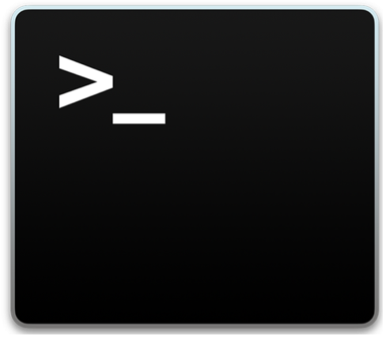

# Running NGS Pipelines: how to run NGS bioinformatics pipelines using Nextflow on the LMB compute cluster

Version 2024.1 

## Licence
This manual is © 2024, Steven Wingett

This manual is distributed under the creative commons Attribution-Non-Commercial-Share Alike 2.0 licence. This means that you are free:

to copy, distribute, display, and perform the work

to make derivative works

Under the following conditions:

Attribution. You must give the original author credit.

Non-Commercial. You may not use this work for commercial purposes.

Share Alike. If you alter, transform, or build upon this work, you may distribute the resulting work only under a licence identical to this one.

Please note that:

For any reuse or distribution, you must make clear to others the licence terms of this work.
Any of these conditions can be waived if you get permission from the copyright holder.
Nothing in this license impairs or restricts the author's moral rights.

Full details of this licence can be found at 
http://creativecommons.org/licenses/by-nc-sa/2.0/uk/legalcode

 
 
# Introduction
## What this course covers
This course is intended for people learning to analyse Next-Generation Sequencing (NGS) datasets and focusses on the initial bioinformatics processing of raw data generated by sequencers.  This typically involves launching a pipeline to perform quality control on the data and map reads to a reference genome, followed by quantitating and summarising the results (e.g. a matrix of genes quantitated for RNA expression).  Although this is by no means the endpoint of NGS analysis, participants completing this course will learn how to convert seemingly unintelligible data to a point which is ready for bespoke investigation.

Specifically, the course explains how to run newly installed bioinformatics pipelines on the LMB’s compute cluster.  While the course content is tailored to the setup at this institute, much of the concepts and methods can be applied to other computational infrastructure.

## Assumed prior knowledge
The course is aimed at the absolute beginner and assumes no prior knowledge, except that expected of a wet-lab molecular biologist – such as familiarity with RNA-seq, ChIP-seq etc.  No advanced computing skills are required, but participants are expected to be able to use everyday software on a modern desktop or laptop computer.

## Content overview
The course has five parts.  The first introduces the concept of a “compute cluster” and then describes the set-up at the LMB, providing details on how to access the machine.  The next part introduces the Linux command line interface, which is the method by which users interact and control the cluster.  This is by no means an exhaustive or even particularly detailed description of using Linux, but it does introduce the key concepts you need to know for working on the cluster.  The third part gives an overview of Next Generation Sequencing, while the fourth part explains how to run jobs that make optimal use of a compute cluster.  The final part goes over how to run NGS pipelines at the LMB using the Nextflow pipelining system.

Prerequisites – please action these points in plenty of time BEFORE the course
Obtain a cluster account
You will need to be registered to gain access to the cluster, so please make sure you have an account.  

To do this, complete the online form at:
https://bb8.mrc-lmb.cam.ac.uk/userdash/slurm.cgi

Please fill out this form in plenty of time **before** the course.

Software
Attendees will need to bring their own laptops to the course, which should be running a recent version of Windows or macOS.   Please install recent versions of the following software before attending the course:

Windows systems:
FileZilla Client - https://filezilla-project.org/
Putty: https://www.chiark.greenend.org.uk/~sgtatham/putty/latest.html

macOS:
FileZilla Client - https://filezilla-project.org/

Network Access
Please make sure you bring a machine that can already connect to the LMB intranet via wi-fi (not the Guest network). If you can view the following page using wi-fi then you have access: https://bb8.mrc-lmb.cam.ac.uk/userdash/slurm.cgi

# Cluster Computing
# What is a compute (or computer) cluster?
A compute cluster is a set of computers that work together so that they can be regarded as a single entity. These inter-connected computers (known as nodes) run software to coordinate the running of programs across the system.  The diagram below gives an overview of a compute cluster. 

 
Figure 1 - Compute cluster schematic

This setup enables the processing of data simultaneously across multiple nodes to speed up running times.  The LMB has a particularly powerful computing cluster comprising (at the time of writing) 130 CPU nodes with 112 hyperthreaded cores.  Each of these nodes has access to 754GB of RAM.  What this means is that the cluster may theoretically perform 130  112 = 14,560 processes simultaneously.  This is significant, for the extent to which a job may be subdivided and parallelised will greatly reduce the required processing time.  In practice, for the sake of fairness to everyone, a single user will not be able to use all the allotted nodes at once, but nevertheless taking advantage of the parallelisation capabilities of a computer cluster should substantially reduce processing times.  To put this in perspective, it is typical for a new MacBook Pro to have only 4 cores installed.

Each of these compute nodes is connected to a data storage array.  The key storage array at the LMB is named cephf2, which currently has a capacity of 7.1 PB.  While this may sound gigantic, maintaining such storage drives is needed to keep parity with the burgeoning data output produced by new life sciences technologies, such as Next Generation Sequencing.

In addition to possessing considerable processing and storage capabilities, compute clusters are preferable to standard setups in that they are not usually turned off and have specialist software for managing the jobs of multiple users and how those jobs are distributed between the compute nodes.

When logging into the cluster, users will connect to one of the three head nodes (hal, hex or max).  The user will then instruct the head node that a job is to be performed.  The intensive computational tasks will not be carried out on a head node itself, but instead the job or jobs will be farmed out to one or more compute nodes.  Job requests are placed in a queue until system resources become available.

(There are other types compute nodes other than CPU nodes installed on the cluster, but we will not be using them in this course.)

## Accessing the Cluster
As mentioned previously, the first thing you need to do is get an account on the compute cluster via an online form:

https://bb8.mrc-lmb.cam.ac.uk/userdash/slurm.cgi

The descriptions below describe how to access the compute cluster when working physically on-site, at the LMB.  For remote access (outside the LMB intranet), you will first need to connect to the atg server – look at the Scientific Computing intranet pages for details on this.

Generally, people will be using PCs running Windows or Macs running macOS.  These different setups require different methods to access the cluster (we assume people running Linux already know how to connect).

### Cluster access via a Windows Machine
Ensure that the software Putty is installed on your computer (it can be downloaded from: https://www.chiark.greenend.org.uk/~sgtatham/putty/latest.html).

Once you open Putty, you should see a window similar to that displayed below.  Enter your cluster username with @hal appended in the Host Name box.  For example, if your username is jsmith, then enter jsmith@hal.  Leave the Port set to 22.  Click Open to access the cluster.

If you would like to view images directly from the cluster, you will need to enable X11 forwarding before connecting.  In the left-hand side pane select Connection -> SSH -> X11 and then check the Enable X11 forwarding box.

### Cluster access using a Mac
Open the terminal window. Do this by double-clicking the terminal icon (a black square with the >_ symbol in the top left corner).  Alternatively, press cmd + space simultaneously and then type terminal in the Spotlight Search bar.

Figure 2 Mac terminal icon

The terminal window should now have opened.  To tell your Mac to connect to the cluster, enter the following command:

ssh -Y hal

(The -Y is not strictly necessary, but it enables the transfer of images.) 

Then enter your cluster password (which should have been sent to you after you registered for cluster access). When you successfully login, a message will be displayed in the terminal window – usually informing you when you last logged in.

## Transferring files to and from the cluster
It is often necessary to upload files to or download files from the LMB cluster to your local machine.  There are several ways to do this, but we recommend using the application FileZilla Client.  It is widely used, distributed as free software and has an intuitive drag and drop interface.  It can be downloaded from https://filezilla-project.org in either a Windows- or macOS-compatible format.

 
On opening the software, you should enter your login credentials in the bar towards the top of the screen.  In addition to your Username and Password, you need to enter the Host - which is hal, and a Port – which is 22.

When you have logged-in you should see your local machine’s filesystem in the left-hand pane and the remote machine’s (i.e. the cluster’s) filesystem in the right-hand pane.  Simply drag and drop icons between the two to move files and folders from one machine to another.

## Getting to grips with Linux
Unlike Macs (which run macOS) or PCs (which run Windows), our compute cluster runs a Linux operating system.  There are many different distributions of Linux, with each having different strengths.  For example, the well-known operating system Android, optimised for mobile devices, is based on a version of Linux.  The LMB compute cluster now mainly uses AlmaLinux (after recently transitioning away from Scientific Linux).  AlmaLinux is open-source and free to use.

This operating system may seem unfamiliar at first, since it does not receive input from the user via a mouse.  Instead, the user types instructions into what is known as the command line.  Although this may seem a needlessly complicated and old-fashioned way of doing things, with a little experience a user can achieve complex tasks relatively easily with just a few simple commands.  In fact, despite being a little less intuitive, the command line is actually often a more convenient and powerful way of interacting with a computer, which is why it is favoured by computational biologists and bioinformaticians.  

### Shells
When a user enters a command, it is read by a command line interpreter, a type of program known as a shell.  A shell therefore allows a user to launch software, but it also provides additional functionality such as keeping a history of commands executed, enabling customised settings to be set up permanently using start-up scripts, as well as providing a simple programming language to automate jobs.  

To quickly check your shell is working, type date in the command line and then press Enter.  The current date time should then be displayed.

A note on how entering text into the command line is referenced in this manual
Code and computer output is denoted in this manual using a different font from regular text.  When referring to the command line, all text entered by the user will be preceded by a $ symbol (a command prompt, which the user should NOT enter).  Output text generated by the Bash shell will not be proceeded by the $ symbol.    

There are many different shells available, of which Bash is arguably the best known.  Unfortunately this is not the default shell used by the cluster and so we advise changing this setting the first time you log in to the cluster.  Once this is set up, you shouldn’t need to change anything again.  Follow the instructions below to set Bash as your default shell.

Check which shell you are currently using:
    
    echo $SHELL

If the output ends with the word bash then you do not need to change the shell.  However, if something else is reported instead (probably “tcsh”), then you will need to contact Scientific Computing to change your default shell.  However, you can temporarily run a bash shell inside your current shell by typing:

    bash

This will expire when you next logout.

### Introducing the Linux commands (ls)
When a valid command is interpreted by the shell it will execute a program.  For example, the command ls will launch software that lists files and folders (the latter are also known as directories).  The action of a command may be modified by what are termed flags, options and arguments.  Below summarises the general structure of a command.

    command [-flag(s)] [-option(s) [value]] [argument(s)]

So, the command ls displays the files and folders in the current working directory (this term will be described in more detail later).

    ls
    directory1  file1.txt  file2.txt  file3.txt

#### Flags
The ls command’s operation can be modified with the addition of a flag.  Some flags will be whole words, while others will be single letters.

For example, to obtain more information on the files and folders being listed, use the -l flag.

    ls -l
    total 12
    drwxrwxr-x 2 swingett swingett 4096 Jul 15 15:59 directory1
    -rw-rw-r-- 1 swingett swingett    0 Jul 15 15:57 file1.txt
    -rw-rw-r-- 1 swingett swingett   17 Jul 15 16:35 file2.txt
    -rw-rw-r-- 1 swingett swingett   37 Jul 15 16:34 file3.txt

It is also possible to combine multiple flags.  The additional flag --human-readable displays file-sizes in terms of kilobytes, megabytes, gigabytes etc. to make for easier reading and interpretation.  Notice that the flag using full words is prefixed with 2 hyphens, whereas flags prefixing single characters have one hyphen.

    $ ls -l --human-readable
    total 12K
    drwxrwxr-x 2 swingett swingett 4.0K Jul 15 15:59 directory1
    -rw-rw-r-- 1 swingett swingett    0 Jul 15 15:57 file1.txt
    -rw-rw-r-- 1 swingett swingett   17 Jul 15 16:35 file2.txt
    -rw-rw-r-- 1 swingett swingett   37 Jul 15 16:34 file3.txt

It is possible to abbreviate some flags (when the abbreviation does not create ambiguity). For example, the flag --human-readable can be abbreviated to -h.  Furthermore, such single-character flags can be combined to reduce typing: ls -l -h is equivalent to ls -lh

#### Options 
In contrast, Linux commands may take options which are similar to flags, but take values.

    ls -l --sort=size
    total 12
    drwxrwxr-x 2 swingett swingett 4096 Jul 15 15:59 directory1
    -rw-rw-r-- 1 swingett swingett   37 Jul 15 16:34 file3.txt
    -rw-rw-r-- 1 swingett swingett   17 Jul 15 16:35 file2.txt
    -rw-rw-r-- 1 swingett swingett    0 Jul 15 15:57 file1.txt

#### Arguments
And a command may take values.  Here the command will print only files with the names file1.txt file.3.txt.  The values file2.txt and file3.txt are passed directly to the list command.

    ls -l file2.txt file3.txt
    -rw-rw-r-- 1 swingett swingett 17 Jul 15 16:35 file2.txt
    -rw-rw-r-- 1 swingett swingett 37 Jul 15 16:34 file3.txt

This might seem a little esoteric at the moment, but the take-home message is that commands are passed to the cluster using the command line.  The action of these commands can be modified by flags, values passed to options and/or arguments.

#### Introducing the Linux filesystem
You no doubt are already familiar with the concept of filesystems when using Macs or PCs: computer files typically sit within a directory or within a series of nested directories.  This also applies to Linux systems, where the directory structure is represented using a line of plain text and in which each folder name has a forward slash (/) appended.

In the example below, file1.txt resides in a folder named jsmith, which in turn is located in a folder named home, which is found in a folder named lmb.  These nested folder structures can be complex and much longer than this, but the same concept applies.  Also, you should note that at the start of the line of text is a forward slash.  This denotes the root directory, which is the top-most directory in the Linux filesystem hierarchy i.e. all files and folders ultimately sit within the root directory.

    /lmb/home/jsmith/file1.txt

#### Relative vs absolute paths
The path listed above is what is termed as an absolute path, which means it contains the complete file hierarchy listing.  There is in contrast what is known as a relative path that lists the position of a file or folder relative to the current working directory.

Suppose your current working directory was /lmb/home/jsmith, and you wished to reference a file at location /lmb/home/pjones/file2.txt.  You could use the previous absolute path, but another way would be to use the relative path: ../pjones/file2.txt.  The 
double dots (..) mean go up one level in the file system hierarchy. 

Similarly, the single dot (.) refers to the current working directory.  Consequently, the path ./file4.txt references a file in the current working directory.

The symbol tilde (~) references the home directory, so ~/folderA/file5.txt refers to a file which is in folderA, which itself is in your Home directory.

You might be wondering why you would choose to use a relative path.  There are two main reasons: firstly, relative pathnames are shorter which saves on typing and reduces the risk of introducing errors.  Secondly, you may not always know the absolute link to a file.  To illustrate the point, suppose you deployed software for public use.  Your software comprises multiple files and those files need to communicate with one another.  But how would this be possible if the software is running on someone else’s computer?  You won’t know in advance the file structure of that device and the location to which your deployed code will be copied.  To get around this you can make use of relative path, in which only a file’s position relative to another is required and not the absolute path.

#### Naming files
The best way to name files is to use only alphanumeric characters, the underscore symbol and the dot. The following filename contains all of these and is acceptable: 

    my_file1.txt

Also, it is best not to use spaces in filenames, even though people quite happily do this when using Windows and macOS.

By convention, it is also common to give an indication of filetype in the file extension – the final dot and following characters.  In the above example the extension is .txt which by convention denotes a text file.

You may not be aware, but there are hidden files on a Linux filesystem.  Hidden files begin with a dot, for example:

    .hidden_file.log

These are typically configuration files or log files.  If you run the ls command, hidden files will not be returned.  However, add the `--all` flag to display hidden files i.e. `ls --all`.

Using commands to navigate and manipulate the file system
Now that we have introduced Linux commands and the filesystem, we can put them together and navigate around the computer and start making directories and moving files (analogous to what can be achieved with a mouse and pointer when using PCs or Macs).  

We’ve already introduced the ls command to list file and folders, but here is a list of some of the other most commonly used commands to move around the filesystem.

`pwd` (print working directory)
This command prints the current working directory of the user.  This might sound a strange concept, but the user can be viewed as having a “location” in the system file structure.  pwd reports back the user’s position.

    pwd
    /lmb/home/swingett

It is possible to move to other locations, as described later.

`cd` (change directory)	
This changes the user’s current working directory. Specify the directory you wish to move to after the command.  The following command changed the current working directory to data1:

    cd /lmb/data1

There are several useful shortcuts when moving between directories
Move to previous directory: `cd –`
Move to home directory: `cd` or `cd ~`
Move “up” a level in the file structure hierarchy `cd ..`

`cp` copy
This command enables the user to copy a file from one location to another.  Below is a simple copy command that copies file.txt to a new file named file_copy.txt.  (Note that two files sitting in the same folder can’t have the same name, and so the new file needs a different name from the input file.)

    cp file.txt file_copy.txt

In the example below, file1.txt is copied to a new folder:

    cp file1.txt /data_folder/file1.txt

It is also possible to copy directories and their contents.  This requires a recursive copy:

    cp -r directory1/ directory_copy/

`mv` (move)
This allows the user to move files and folders from one location to another.  In the example below the file file.txt is moved to the new_location folder:

    mv file.txt /lmb/data/new_location

Maybe a little surprisingly, the mv command can be used to rename a file:

    mv original_name.txt new_name.txt

`mkdir` (make directory)
To make a new directory or directory use the mkdir command.  The command below makes three new directories:

    mkdir new_directory1 new_directory2 new_directory3

`rmdir` (remove directory)
To remove an empty directory use the rmdir command:

    rmdir directory1 directory2 /data/directory3 

`rm` (remove)
To remove a file or files use the rm command:

    rm file1.txt file2.txt /data/file3.txt

Do this recursively to delete directories that are not empty (along with all of their contents).

    rm -r directory1 directory2 /data/directory3 

Most Linux systems will delete files immediately following a user’s request.  However, to prevent people accidentally deleting files, the cluster has been set up to require keyboard confirmation for every individual file to be deleted.  This can be a time consuming process if many files need to be removed simultaneously.  To stop the system requiring the additional confirmation, append the -f flag to the remove command. 

**<u>Warning!</u>
Unlike Windows and MacOS, the command line version of Linux on the cluster does not have a Recycle Bin, which means that once a file has been deleted it is gone forever! So be extra careful when deleting files as it is easy to specify the wrong location and potentially lose many hours of valuable work.**

Linux tries to help you!
It’s easy to lose track of what you have been doing when typing successive rounds of text into the command line.  However, by typing history you can see a list of the recent commands executed. Alternatively, press the 
&uarr;
 or 
&darr;
 arrows to navigate through your recent history.

Furthermore, by typing CTRL + R and then typing a command of interest, the Bash shell will report the closest matching command from your history.

Also, typing long commands and filenames and file structures can be quite difficult.  Fortunately, the Bash shell comes with a very useful autocomplete function which we strongly recommend using, as this is easier for the user, saves time and reduces the risk of typos.  

To use autocomplete, start typing your command and then press TAB or TAB + TAB to autocomplete/display suggestions.  This may take a bit of getting used to, so it is worth spending time practising with this feature to get it working optimally.

#### Reading and writing files
In this context we are talking exclusively about text files, or compressed text files.  Linux has a number of simple programs to allow the user to view, write to and edit files.

`cat` (concatenate)
To view the contents of a text file, use the concatenate command.  (The name of this command may not make much sense now, but hopefully will later on). 

    cat file.txt

This is generally fine for smaller files, but for larger files in which dumping a large amount of text to the screen in one go is undesirable, I would recommend using one of the following commands:

`head` Prints out the first 10 lines of a file:

    head file.txt

`tail`
Prints out the last 10 lines of a file:

    tail file.txt

`more` enables the user to scroll through a text file line-by-line or page-by-page.  To open the more viewer type:

    more my_file.txt

Once the file is displayed to the screen, press enter to move through the file one line at a time.  Use the space bar to scroll one page at a time.  Press Q to exit the more viewer.

Again, there are many flags and options that can be applied to give additional functionality to more.  There is also a related program named less which has additional functionality when reading text files.  See which text viewer most suits your needs.

#### The nano text editor
There are many ways to edit a file in Linux.  The operating system is shipped with a text editor called Vi, but it is not the most intuitive software for novices and so we recommend using nano – already installed on the cluster – which marks a good compromise between wide-ranging functionality, yet is still relatively lightweight and can be run in a terminal window.

Simply type nano on the command line and the software will start and display a screen similar to that shown below.  You can now start writing text in this window and then to save your text simply press CTRL + O.  When using nano, option menus and prompts will appear at the bottom of the window (please note that the ^ character in a menu denotes the CRTL button).  

To exit the program type CTRL + X. 

 
To open and view/edit a text file that already exists simply pass the name of the file you wish to open to nano:

    nano file.txt

If you want to create a new, empty file then simply specify the name of this new file when starting nano:

    nano new_file.txt

#### Compressing and uncompressing files
Much of the NGS data that you will process and generate will be in text format.  However, storing data in this way is not very efficient in terms of memory.  When reasonably possible, all large text files should be compressed.  This is most commonly achieved on Linux using gzip:

    gzip file1.txt file2.txt file3.txt
 
This will create files named file1.txt.gz etc. (the .gz file extension denotes that the file has been compressed).  This gzipping process is related to the zipping, which is commonly performed on Mac and PCs.

To decompress the file, use the gunzip command:

    gunzip file1.txt.gz file2.txt.gz file3.txt.gz

##### Viewing Compressed files
It is possible to read the contents of gzipped file without decompressing first.  To do this use the zcat command:

    zcat file.txt.gz

As before, this is not ideal for large files, since all the data will be written to the screen in one batch.

`Redirects (> >>)`
Before moving on, we need to introduce pipes and redirects, for these allow commands to be linked together and thus become more versatile.

By default, command output is written to the screen (which is known technically as standard out).  It is possible however to redirect this output to a file.  For example:

    cat file1.txt > file1_copy.txt

Here the contents of file1.txt is read and written to file1_copy.txt (which therefore is a copy of the input file).  This might not seem useful at first, since this is essentially the same as running the copy command we encountered earlier.  However, multiple input files may be passed simultaneously to the cat command, and thus the contents of these files will be combined in one output file. 

    cat file1.txt file2.txt file3.txt > combined.txt

This process is known as concatenation, which is why this command is named `cat`.

It is also possible to append contents to a file using the double arrow redirect.  The contents of file4.txt could therefore be appended to the end of combined.txt:

    cat file4.txt >> combined.txt

`Pipe (|)`
The pipe `|` is a way of taking the output from one command and passing it directly to another command.  For example, by piping zcat output to the more command, it is possible read directly a gzipped file without decompressing it first

    zcat file.txt.gz | more

This is particularly useful since decompressing a large file can take a considerable amount of time.  If you wanted to just view the first few pages of text then piping `zcat` output to more is a much better alternative.

#### Searching files with `grep`
You are no doubt aware that it is possible to find user-specified words and phrases in text editors (such as Notepad).  Well, it is also possible in Linux using the grep command.  Simply pass your search term and the name of the text file you wish to search to the grep command.  All the lines containing that search term will be returned.

For example, the following will return all the lines of text containing the word “organoid” in the text file thesis.txt.

    grep organoid thesis.txt

As with other Linux commands, the mode of action of grep can be modified using flags, to refine your searching.

#### Getting Help
The command line might feel quite alien to the complete novice, but there are built-in features to help you get to grips with these commands.

1) Execute whatis to explain what a command does.  For example, to learn more about the gzip command:

    whatis gzip

2) If you need a complete and official explanation of a command, refer to the built-in manual:

    man gzip

3) The built-in manual is complete and authoritative but can be overly technical for the novice.  There are however plenty of discussion groups online where Linux commands are explained.  Just Google to find one you like.

4) Always have your trusty cheat sheet to hand!

#### Wildcards
For the Linux commands we have been looking at so far, which take filenames as arguments, we have been passing individual or several specific filenames as arguments.  While this is acceptable for a small number of files, it may not always be practicable.  However, Linux makes use of built-in wildcards to make this easier.  A wildcard is a way of symbolically representing characters.

The asterisk symbol * matches none or more characters.  So, suppose you have text files in a directory that are named after the countries in the UK (i.e. england.txt, northern_ireland.txt, scotland.txt, wales.txt).

    ls *land.txt
    england.txt  northern_ireland.txt  scotland.txt

(Matching none might sound like a strange idea, but if you think about it, if this were not the case then look-up terms such as *england.txt would fail to match.)

The wildcard question mark ? matches exactly one character:

    ls wa?es.txt
    wales.txt

The character class is also useful.  It matches any of the single alphanumeric characters in the list:

    ls [es]*.txt
    england.txt  scotland.txt

Be aware that placing non-alphanumeric characters in the list can change its mode of action, so please read up on this if you wish to know more.

#### Links to files
You are probably already familiar with the concept of shortcuts on Windows systems, or aliases on Macs.  This is where we create a link in one location to reference a file somewhere else.  For example, we may have an MS Word document that is buried somewhere on our filesystem, but we would like to be able to access this file directly from the Desktop.  However, we don’t want to move the file itself to the Desktop.  A way to do this is is create a Shortcut (or Alias) to the file of interest.  If the link is accessed, then the target file is opened.

Well, Linux has something similar called a symbolic link.  Symbolic links are created with the command:

    ln -s /target_folder/target_file_of_interest.txt

This will create a symbolic link named target_file_of_interest.txt in the current working directory.  It is possible to name the link differently from the target file by adding the link name at the end of the command:

    ln -s /target_folder/target_file_of_interest.txt link.txt

It is also possible to link to multiple files in one command by specifying the current work folder (dot) at the end of the command:

    ln -s /target_folder/*.txt .

#### File permissions
In a previous example which demonstrated the command ls -l, the system returned the list of files in the current directory, along with additional information.  This is known as long format.

Explanation of long format:

 
Column Number	Description
1	File type (- file / d directory / l link) 
2	Permission string (user / group /everyone)
3	Number of hard links
4	Owner name
5	Owner group
6	File size in bytes
7	Modification time
8	File name

This means that the owner of the file is zeus.  The file belongs to the group gods.

The permission string explains who can read (r), write to (w) or execute (x) the file.

So, the owner of the file (zeus) can:
rwx (read, write and execute the file)

Members of the group (gods) can:
r-x (read, not write to, but can execute the file)

Everyone else can:
r-- (only read the file)

It is possible to check to which groups which you belong with the command groups.  It is also possible to change the read/write/execute permissions of a file with the command chmod.

#### Variables
Similar to programming languages such as Python and R, the Bash shell allows users to create and read system-defined variables (these stores information in a fashion akin to algebra in which letters are used to represent numbers).  The variable $USER stores your username.

#### Other useful commands
`echo`
The command echo takes text and prints it to the terminal, or this output can be redirected to files or other commands.  It will also interpret variables.  For example, try:

    echo Hello $USER

Notice that your username is displayed, rather than printing literally “$USER”.

`sort`
This command sorts lines of text.

`curl`
This command is used for transferring data to and from a server.

`dos2unix` / `mac2unix`
This is a useful piece of software to install on a Linux system for there is, unfortunately, an incompatibility between Linux and Windows / Mac systems with regard to how textfile line endings are interpreted.  Consequently, text files generated on Windows / Mac machines may not be processed correctly when running on Linux.  The dos2unix / mac2unix commands correct this discrepancy by modifying such line-endings.  Note: this command edits the input file.

### Running Jobs
This next section introduces commands that are useful for long-running jobs and gives guidance on how to monitor commands that are running.

`$PATH`
To run an executable file, you need to provide the full path (filesystem link) to that file e.g. /path/to/executable_file.py.  However, when running software such as ls and cp (remember these commands are actually programs) you will not have had to provide a full path, for simply the name of the program will suffice.

Why is this?  Well, the folder that contains these programs is specified in the $PATH variable.  To see the folders contained in the $PATH variable (each individual folder is separated by a colon in the output):

    echo $PATH

Use the which command to find the location of a piece of software found in a PATH folder

    which ls
    /bin/ls

The command will also report if the software is not found in the $PATH.  It is common to add external software (i.e. software not part of the Linux distribution) to the path.

`ps`
This commands displays information about your current active processes.  This is a good way to see the jobs you have running

`top`
This command is similar to ps in that it provides information on running processes, however unlike ps, it produces a continually updated display. To exit the display press the key q.  Also, this command will display all processes currently running, but to display just your jobs type your username:

    top -u $USER

`nohup`
Suppose you have started an important and long-running command on your system but then you need to log off which would cause your job to terminate.  This problem can be overcome with nohup (means no hang-up), which allows your job to keep running, even if you logout.  For example, to apply no hang-up to a copying job:

    `nohup cp -r /path/to/data/ .` 

`Backgrounding`
You may have noticed that once you start a job, you cannot enter anything in the command line until it completes.  This can be overcome by backgrounding the process by appending an ampersand (&) to the command:

    nohup cp -r /path/to/data/ . &

Alternatively, currently running jobs can be stopped with CTRL + Z.  The command bg can then be used to background the job.  In contrast, the command fg will move a job from the background to the foreground.

`kill`
Suppose you have started a long-running process, but realise you made a mistake and want the process to end.  To do that, look up the process id (PID) using ps or top.  Then end the process (or multiple processes) with the kill command.  The example below ends processes 3101 and 3102:

    kill 3101 3102

Should that fail, you can force a process to terminate by adding the -9 flag:

    kill -9 3101 3102

This should only be used if the command kill fails to terminate the selected processes.  Although the name suggests otherwise, the kill command terminates a process gracefully (e.g. ensures data has finished saving etc.).  However, should that not work, the command kill -9 will close running processes immediately.  (The former is similar to closing a program using the Close button on a Windows system, the latter is akin to forcing a program to close with the Windows Task Manager.)

`exit`
The exit command is used to end a Linux session.

### Additional tips
Make use of Linux cheat sheets such as the one distributed with this course.  They are useful to have to hand and serve as an excellent aide-memoire when writing Linux commands.  If that doesn’t help with a specific task, then searching around on Linux discussion groups or using Google is a good way to find out what you need to know.

 
# Next-generation sequencing
## Introduction
Next-generation sequencing (NGS) is a massively parallel sequencing technology that offers ultra-high throughput. The technology can be used for a wide range of applications, such as determining the genomic sequence of an organism, the expression levels of all the genes in a tissue, epigenetic modifications or even conformational changes.

The most commonly used NGS technology is the Illumina platform which generates millions to billions of short reads (typically 50 – 300bp in length) per run.  Should longer reads be required, then researchers can opt for PacBio or Oxford Nanopore platforms which generate much longer, but far fewer reads. Typical RNA-seq, ChIP-seq and ATAC-seq experiments use the Illumina technology and therefore this section discusses sequencing from the perspective of using this platform.

## Common types of analysis
In the past decade high-throughput sequencing has been widely adopted by the life sciences community, which in turn has led to an ever-expanding array of new molecular biology techniques.  

Common NGS-based protocols include:
    large whole-genome sequencing (human, plant, animal)	 	 	 	 
    small whole-genome Sequencing (microbe, virus)	
    exome & large panel sequencing (enrichment-based)	 	 	 	
    targeted gene sequencing (amplicon-based, gene panel)	
    single-cell profiling (scRNA-seq, scDNA-seq, oligo tagging assays)	 	 	
    transcriptome sequencing (total RNA-seq, mRNA-seq, gene expression profiling)	 
    targeted gene expression profiling	
    miRNA and small RNA analysis	
    DNA-protein interaction analysis (ChIP-seq)	 	 	
    methylation Sequencing	 	 	 	 
    16S metagenomic sequencing	 	
    metagenomic profiling (shotgun metagenomics, metatranscriptomics)	 	 	
    cell-free sequencing and liquid biopsy analysis
    chromosome capture sequencing (e.g. 3C, 4C, 5C, Hi-C, capture Hi-C)

While the library preparation and data analysis steps might be different for these applications, the sequencing process and data generated is broadly similar. 

## Equipment
There is currently a variety of different sequencers available which are tailored for different use cases.  Researchers need to balance experimental objectives in terms of coverage against cost factors and equipment availability in deciding what type of sequencing to perform.  Below gives an overview of the specifications of current (at the time of writing) Illumina sequencers.

    iSeq 100
    MiniSeq
    MiSeq Series 
    NextSeq 550 Series 
    NextSeq 1000 & 2000	NovaSeq 6000
Run Time (hours)		9.5–19 	4–24	4–55	12–30	11-48	13-44
Maximum Output (Gb)	1.2	7.5	15	120	330	6000
Maximum Reads	4 million		25 million		25 million	400 million		1.1 billion	20 billion
Maximum Read Length	2 × 150 bp	2 × 150 bp	2 × 300 bp	2 × 150 bp		2 × 150 bp	2 * 250

### Illumina sequencing process
The sequencing reaction takes place on equipment termed a flow cell.  The flow cell is subdivided into multiple lanes into which the sample libraries are added.  After addition of the sample, the flow cell is loaded into the sequencer.

Central to this sequencing methodology is the surface of the flow cell, which has been coated with a lawn of oligonucleotides.  Also, during library preparation, adapter sequences were appended to the sample DNA molecules.  Upon loading of the sample, the lawn olignonucleotides and adapter sequences  hybridise to one another, thereby anchoring the sample DNA to the flow cell surface.

Successive rounds of hybridisation, replication and then de-hybridisation on this oligonucleotide lawn leads to the target DNA molecules becoming amplified while, significantly, remaining in close proximity to all their clones.  This process is termed cluster generation by bridge amplification and generates millions of copies of single-stranded DNA. 

Figure 3 – bridge amplification, courtesy of Abizar, Wikipedia https://en.wikipedia.org/wiki/File:DNA_Sequencing_Bridge_Amplification.png

In a process called sequencing by synthesis (SBS), chemically modified nucleotides bind to the DNA template strand through base-pairing. Each of these synthetic nucleotides contains a fluorescent tag and a reversible terminator that blocks incorporation of the next base. A fluorescent emission signals when a nucleotide has been added, and the terminator is cleaved so the next base can bind.  Consequently, by recording the wavelength (colour) of the fluorescent emissions of each cluster, it is possible to deduce the sequence of the original “seeding” DNA molecule.

 

Figure 4 - sequencing by synthesis, courtesy of DMLapato, Wikipedia: https://commons.wikimedia.org/wiki/File:Sequence_By_Synthesis.png#filelinks

### Single-end / paired-end sequencing
For single-end sequencing, one read is reported for each sequenced DNA fragment.  In contrast, paired-end sequencing involves sequencing both ends of a fragment.  Paired-end sequencing aids the detection of genomic rearrangements and repetitive sequence elements, as well as gene fusions, novel transcripts and indels.

Figure 5 - comparing single-end to paired-end sequencing

### Barcodes 
Different sample libraries can be pooled and then sequenced simultaneously by a process known as multiplexing.  With this strategy, barcode sequences are added to each DNA library preparation.  These barcodes are sequenced in addition to the DNA of interest, and thus different samples can be identified and separated from one another during the data analysis.

### UMIs
Unique molecular identifiers (UMIs) are a type of molecular barcoding that improves accuracy during sequencing.  The DNA molecules in the starting material are tagged with a UMI and therefore it is possible to bioinformatically identify and remove PCR sequence duplicates (as opposed to duplicates arising from independent DNA fragments of identical sequence).  This step is useful in a range of applications, such as RNA-seq expression analysis and variant calling, among others.

### File Formats
#### FASTQ
The standard data output format from these sequencers is known as FASTQ. Such FASTQ files are essentially text files which record the sequence of each read, along with an associated quality score which provides an estimate of the reliability of each base call. These files (usually in conjunction with genome reference and relevant metadata files) are what are processed by NGS bioinformatics pipelines.  Owing to their large size, FASTQ files are typically compressed using gzip.

You may already be familiar with FASTA format to report nucleotide sequences.  FASTQ format is similar to that, but it also reports a metric called a quality score, which reflects the likelihood of a given base-call being correct.

Look at the extract from a FASTQ file below, which shows the information pertaining to a single read.
  
    @SRR071233.197343 NRTG514-16_0001:3:2:6067:17258 length=40
    TGGGTAGTATTTGGTTACATGAGTAAGTTCTTTAATGGTG
    +
    CCCCCCCCCCCCCCCCCCCCCCCCCCCCCCCCCCCCCCDC

Each read will comprise 4 lines of text:

Line1 – the contents of this line may vary, although it should always begin with the @ character and is then followed by the sequence identifier.  In this example, the identifier is a public repository accession number (SRR071233), followed by the number of reads within the file (197343). 

There is then additional information referring to the machine that was used to perform the sequencing.  There is also information about where the read was detected - 3:2:6067:17258 (lane3 : tile2 : x coo-ordinate 6067 : y co-ordinate 17258).  Also included in Line1 is the length of the read – which in this case is 40 base pairs.

Line 2 – the nucleotide sequence reported.  Bases that cannot be called with sufficient confidence are represented by an N.

Line 3 – by convention this is a + character (or sometimes a repeat of line 1).

Line 4 – the quality scores associated with each base-call.  In this case the quality score is either a C or a D.

##### Explanation of quality scores
This score reports the quality of the base-call two lines above and in the same column in the FASTQ file.  The quality score could be a number, but it could be a letter or a symbol.  Significantly, each of these characters can be converted to a numerical value. (This indirectly makes use of ASCII encoding, native to computers, in which every character has a numerical value.) Below lists the possible characters (which begin with an ! which corresponds to a score of 0, reaching a maximum score of 40 with the letter I).

    Character: !"#$%&'()*+,-./0123456789:;<=>?@ABCDEFGHI
            |                                       |
    Quality:   0                                       40

So that is how each base call is assigned a quality score, but what is the meaning of a score of 0 as opposed to, say, a score of 40?  Well, the higher the score the better the quality.  Technically, quality scores are defined by the following equation:

Quality = -10 log_10⁡〖p/(1-p)〗
In which p is the probability the base call is incorrect.

FASTQ files are typically processed by aligners which use the base call and the alignment scores to map reads to a reference genome.

#### SAM / BAM
Sequence aligners that map FASTQ files to a reference genome typically produce output in SAM (Sequence Alignment / Map) format, or a bespoke compressed version of this known as BAM format.  SAM format files should end with the extension .sam, but under-the-hood they are actually regular text files.  BAM files need to be read with an application named samtools and end with the suffix .bam.

The SAM format contains much information relating to how a read was aligned to a reference genome, but we shall not cover this in depth here (but if you are interested in learning more, the canonical SAM format specification is described at: https://samtools.github.io/hts-specs/SAMv1.pdf ).

In brief, SAM format has two parts:

Firstly, at the top of a file, there are header lines that describe the reference genome and how the FASTQ reads were aligned.

    @HD	VN:1.6	SO:coordinate
    @SQ	SN:1	LN:248956422
    @SQ	SN:10	LN:133797422
    @SQ	SN:11	LN:135086622
    .
    .
    .

The rest of the file comprises lines describing every alignment (and sometimes non-alignments as well).   In the example below, the chromosome and genomic position of the alignment are shown in bold.  Notice the sequence and quality score information from the original FASTQ file is also retained in the SAM format alignment. 

    ERR1594715.1	419	1	11669	1	75M	=	1
    1883	289	CAGGTGAAGCCCTGGAGATTCTTATTAGTGATTTGGGCTGGGGCCTGGC
    CATGTGTATTTTTTTAAATTTCCACT	//BBBFFFFFFFFFFFF/FFFFFFFFFFFF/FF
    FFFFFFFFFFFFFFFFF<FFFFFFFFFFFFFFFFFFFFFFFF	MD:Z:75	PG:Z:Mark
    Duplicates	RG:Z:ERX1665301_ERR1594715	NH:i:4	HI:i:3	N
    M:i:0	AS:i:148

    These BAM files are often sorted and indexed to speed up access to the data.  BAM files mark a starting point for a range of computational analyses.

#### Data Repositories
Most journals now require the original FASTQ files from a sequencing experiment to be submitted to a public data repository (such as Gene Expression Omnibus https://www.ncbi.nlm.nih.gov/geo/).  Submitted data can be kept private here and only released once the relevant paper is published.  These data resources allow researchers across the world to download and subsequently analyse the results generated in other labs, and possibly make new discoveries without the need for further experiments.  Having said that, retrieving data from these repositories is not always transparent, but advice on how to do this is given later in this course.

<b>WARNING!  Sequencing facilities tend not to retain their data for more than a few weeks, so make sure you download your sequencing data promptly and store in a secure, clearly labelled and backed-up location.  Also, make sure the file transfer was successful by using a tool such as md5sum and checking file sizes before and after transfer are identical.  Remember, NO SUBMITTED FASTQ FILE, NO PUBLICATION.</>
 
# Slurm
## Introduction
By this point in the course, you have logged into a head node and then executed simple commands – essentially you have been treating the compute cluster as one might treat a simple desktop system.  That is fine for demonstration purposes, but the compute cluster architecture is not designed to be used in this fashion, and in by doing so we are not making use of the cluster’s considerable processing power.  The correct way to use a cluster is to log in to a head node and from there pass jobs to compute nodes, where intensive number crunching can be performed.  

Enabling head nodes to communicate with compute nodes and ensuring all these nodes can communicate with storage arrays, while simultaneously allowing different users to interact with the system while keeping track of all the user’s jobs as they are passed from node to node is far from trivial.  Fortunately, there are specialist software tools for managing these tasks on computer clusters.  The LMB cluster uses one such workload manager known as Slurm.  In this section we shall introduce Slurm and give an overview of how to execute jobs on compute nodes.  

[Bioinformatic pipelines that link software tools in sequential workflows will not be described here, but in the next section that discuses Nextflow and nf-core.]

Other cluster management software is available.  A common alternative is Grid Engine, which in fact was used on the LMB cluster until recently.  But in late 2021 the cluster underwent a major overhaul with the addition of extra nodes, a conversion to Slurm and a phasing-out of Grid Engine.  At the time of writing, Slurm is being tailored for the specific requirements of cluster users at the LMB.

## Using Slurm
The Slurm files are located on the LMB cluster at /user/bin/ where the Linux command line programs are also kept.  This means that Slurm commands should already be in your PATH and be ready to use.  We shall now cover the main Slurm commands you will need.

(Further help regarding these commands can be obtained from the Linux manual – man.)

### Checking the state of the cluster
`squeue`
Earlier in the course we introduced the Linux command top which lists the job currently running on the user’s current node.  Well, squeue is similar, for it reports the jobs that have been added by Slurm to  the scheduling queue.  The command lists both running and pending jobs, as shown in the example below.

Figure 6 - Slurm scheduling queue

The table below explains the different columns.

Column Name	Description
JOBID 	Incrementing numerical IDs for cluster jobs
PARTITION	A partition is a logical division of a hard disk that is treated as a separate unit by operating systems and file systems.  On the LMB Cluster there are cpu, gpu and ml partitions.  The cpu partition is the default and what we shall be using.  The gpu partition is optimised for graphics applications and the ml partition is optimised for machine learning.
NAME	The name of a submitted job.
USER	User who submitted the job
ST	Status of the job i.e. how the job is progressing.  Common status reports include: PD -job pending and waiting for resource allocation; R - job allocated to a node and running.
TIME	Length of time a job has been running
NODES	Number of nodes used for a job
NODELIST 	The name of the nodes being used for a job. LMB compute cluster nodes begin with the letters fmg, followed by a numerical value.

You may wish to view all the jobs running on the cluster, but more frequently you will want to view just your jobs.  To do that, enter on the command line:

    squeue -u $USER

`sqsummary`
This is another useful command that gives a summary of the CPU node state.  It summarises how many CPUs each user is using and the percentage of currently free nodes.

`sinfo`
is used to view partition and node information for a system running Slurm.

`qinfo`
When connected to the LMB intranet, go to the page listed below to view an overview of the current state of the cluster.  The webpage runs the qinfo command and gives a breakdown of all the nodes being used, what jobs are running and which users are running them.
http://nagios2/qinfo/

## Running jobs
We have already stressed that jobs should not be run on a head node directly, since these nodes provide an interface between users and the whole cluster.  If the head nodes become overloaded with intensive tasks, people will no longer be able to interact with the cluster smoothly, or even at all.  

But suppose we want to perform a resource-intensive computation – where would be do this?  Well, it depends on the type of job we want to perform, but generally speaking there are two options open to us:

1) Interactive jobs – run short operations that complete quickly while you wait, check the results and perform another calculation if required

2) Submitted jobs – long-running jobs that do not require user intervention

### Running interactive jobs
To perform interactive jobs we need to move from a head node to a compute node.  Once on a compute node we are free to run Linux commands as before – it’s akin to logging in to a powerful workstation or desktop machine.  To access a compute node, run the command:

    srun --pty bash 

If this has worked correctly you will notice that the command prompt will have changed.  Instead of displaying a prompt of the format username@hal, you will see that hal has been replaced by the name of the node to which you have logged on to, e.g. username@fmb376.  You can pass commands to the node using the Bash shell.

By default, when you logon to a compute node, you will be allocated 1 CPU core.  It may be that your job will need more than this, but you can reserve the number of CPUs you require in advance.  To specify 8 cores, for example:

    srun -c 8 --pty bash

Type exit to leave the compute node and return to the head node.

### Submitting jobs
Non-interactive jobs are submitted from the head node to the Slurm scheduler using the sbatch command.  sbatch takes as an argument a script that contains the Bash commands you wish to run.  Shown below is the contents of a simple bash script named test.sh:

    #!/bin/bash
    echo Hello World!

All scripts you write should start with the line: #!/bin/bash.  This makes it explicit that this is a Bash script, and lists where the Bash executable is located on the filesystem.

The second line is the command you wish to run, which if you remember from before will print “Hello World!” to the screen.

To execute this Bash script on the head node, type:

    bash test.sh
    Hello World!

(Although we are discussing how to submit jobs to the cluster in this section, it is certainly worth knowing that Bash commands can be written to files in this way and subsequently run.  Doing this can save users a lot of time entering the same commands over-and-over again into the command line.)

So, this has had the same effect as simply entering the echo Hello World! on the command line.  Now, in this example, we pass this script to the sbatch command to submit the job to a compute node.

    sbatch test.sh 
    Submitted batch job 2444919

The number of the batch job is unique and is incremented every time a user on the cluster submits a job.

You will notice a file has now been created which contains this job number: slurm-2444919.out.  This file contains the text output that would have been written to the screen if the Bash command had been run directly and not submitted to sbatch.

So, that is how we submit jobs to the cluster: 
1) create a Bash script of the command(s) to execute
2) submit those command(s) to compute node(s) using sbatch

There are a few extra options that should be considered when submitting jobs using sbatch:

Command	Function
-J [jobname] 	specify an easily identifiable jobname
-c [number of cores] 	number of cores on a node to reserve for the job
[default: 1]
--mem=[RAM]G	GB of RAM to reserve for the job
[default: 5]
--mail-type=ALL 	send email updates on the job’s progress
--mail-user=$USER@mrc-lmb.cam.ac.uk	recipient’s email address

So, you could re-submit the command with these options:

    sbatch -J test_job -c 2 --mail-type=ALL --mail-user=$USER@mrc-lmb.cam.ac.uk --mem=2G test.sh

This will submit the job as before but request 2 cores and 2G of RAM and send status update emails to the user as the job progresses.

This command is long, but it is possible to set up an alias in your ~/.bashrc configuration file so you don’t need to type it out in full every time.  We shan’t discuss this here in more detail, but please let us know if you would like more assistance with this.

This leads to the question: what are appropriate amounts of memory and CPUs to request?  Well, this is not a straight-forward question to answer.  Some jobs are clearly more memory intensive that others, but quantifying that in advance is not easy to do.  Under reserve memory or CPUs and the job may crash or take an inordinate amount of time to finish.  In contrast: request too much and you will be denying other users valuable compute resources.  Moreover, the workload management on the cluster is such that a job requiring a large amount of compute resources may wait much longer in the queue before processing even starts.  So, paradoxically, requesting a large amount of resources can lead to a job taking longer to complete!

Perhaps the simplest and most convenient way to make these calculations is to check the resources used by already completed jobs and use that as a benchmark for the future.  Obtaining these metrics on already completed jobs can be achieved with the sacct command.

A note on exit codes
At various points when using the cluster, you may see the term exit code reported.  What does this mean?  Well, when a job finishes it will be assigned an exit code which reports whether a job completed successfully or whether there was some kind of error.  To assist with debugging, different classes of errors are usually assigned different exit codes.  But all you need to know is that an exit code of 0 means the job completed successfully, any other exit code denotes some kind of error. 

`sacct`
The sacct command provides information on the resources used when running a job.  It takes as input the job id (which is included in the the Slurm *.out filename).  

    sacct -j [job id]

To get the maximum memory usage:
    sacct --format=jobID%20,CPUTime,MaxRSS -j [job id]

`scancel`
To kill running jobs use scancel:

    scancel [job id]

### Loading modules
It is quite common for a user to require a particular version of an application for performing analysis.  Selecting the version of the software you require has been made simple with the module command.

To list available modules:
module avail

To use install a module:
module load [module name]

### Viewing images
It is possible to share graphics between the cluster and your local machine.  On a Mac you will need to have the program XQuartz (https://www.xquartz.org/) running.  On a Windows system you should install and run Windows X-server software e.g. VcXsrv (https://sourceforge.net/projects/vcxsrv/).  

While it is nice to visualise images on your local computer in this way, you will probably notice that interacting with such images is not as smooth as you would typically expect.  An alternative approach is to transfer files (e.g. using FileZilla) from the cluster to your local machine for viewing purposes.

This section introduced the key concepts of using Slurm on the LMB cluster, but for more details please view the Scientific Computing page at: 
https://www.mrc-lmb.cam.ac.uk/scicomp/index.php?id=computer-cluster 

# Running bioinformatics pipelines with Nextflow

## What are bioinformatics pipelines?
For the past decade Next Generation Sequencing (NGS) has been used ever more frequently in molecular biology studies, finding uses in new experimental techniques and applications.  Processing NGS datasets is far from trivial however, for it requires substantial computational resources in terms of data storage, RAM (working memory) and processing power.

In addition to these demands, processing NGS datasets typically entails multiple steps, such as quality control (QC), mapping reads to a specified reference genome, followed by preliminary analysis of the alignments and then collating the headline results for the user.  This is not usually performed by one multi-purpose program, but rather a series of software tools – often developed independently of one another at separate academic institutions.  Such a series of steps is what we term a bioinformatics pipeline.

Figure 7 - overview of a generalised NGS bioinformatics pipeline

## Introducing Nextflow
Until recently it was common to see computer scientists and bioinformaticians writing code in their favourite “off-the-shelf” programming language, detailing how software applications relate to one another and how data should “flow” within a pipeline.  While many languages can adequately create pipelines, they were not designed with this objective exclusively in mind.  In contrast, Nextflow was designed from its inception as a bioinformatics workflow manager language and so has a multiplicity of features to streamline and regulate these processes.

We have set up Nextflow on the LMB cluster and it is run using the command line where it provides an interface between the user and Slurm.  In practical term this means that, you don’t need to submit Nextflow jobs as sbatch commands, just run them from a head node and Nextflow will manage everything for you.  Since Nextflow is a versatile and complex tool, there are many Nextflow commands and options that can be executed.  The Nextflow documentation is found at: https://nextflow.io

It is worth pointing out that since Nextflow is essentially a language to enable programmers to write bioinformatics pipelines, the documentation webpages may look heavy on technical jargon.  But not to worry, because the vast majority of this knowledge is not required for actually running a pipeline.

 
## Introducing nf-core
After establishing a syntax for describing bioinformatics workflows, the next goal for this community was to create pipelines for a range of NGS applications.  This endeavour is what became nf-core, essentially a repository of curated Nextflow pipelines.  These pipelines have pooled the opinions and efforts of experts on what constitutes best-practice in NGS processing.  The default settings should suit most standard protocols, but the pipelines have a wide range of options to accommodate different experimental procedures.

Having a large community of people working on nf-core is advantageous, since many eyes on the code helps identify bugs or unexpected behaviours.  Reproducibility has also been at the forefront of this endeavour, and the project is under citable version control and uses containers to ensure consistent data processing.  These projects grew from academic institutions and so Nextflow and nf-core are open-source and free to use.  The nf-core homepage is found at:
https://nf-co.re

We have made a selection of pipelines available on the LMB’s computer cluster.  Although not all the pipelines listed at nf-core are currently available here, we are willing to add more pipelines should there be demand from researchers.  Also, we may write and make available bespoke pipelines should the necessity arise.

## Setting up Nextflow / nf-core
Nextflow takes a little bit of setting up but we have tried to simplify this process by writing a Bash script that does this for you.  To download and run the bash script, execute the following one-line command (more experienced users may prefer to download the script and use it as a setup guide):

    curl -s https://raw.githubusercontent.com/StevenWingett/lmb-nextflow/main/nextflow_setup_cluster.sh | bash

You don’t need to know the details of what the script is doing, but you probably know enough by now to make sense of this step.  The curl command downloads an online script named nextflow_setup_cluster.sh.  The text from this file is written to standard out – which would by default be to your monitor screen.  However, this output is piped to bash.  So, in effect, this command runs the remote Bash script.

If you run the curl command, but don’t pipe it to standard out, you will be able to view the contents of nextflow_setup_cluster.sh.  You will see that the script has three parts:

i) set up Java (a requirement for Nextflow)
ii) Nextflow setup
iii) set up nf-core by installing Python3 (another programming language) modules.

By now, the code in the Bash script should broadly make sense.  We would like to draw you attention to the lines of code involving ~/.bashrc.  This refers to a hidden file in your home directory (remember: the tilda (~) denotes the home folder and hidden files have names beginning with a full stop).  

This .bashrc file sets up you Bash configuration and is read by the Bash shell every time you log in.  You can see that this hidden file in your home folder:

    ls -a ~

View the contents of this configuration file:

    cat ~/.bashrc

In this file you will see how the $PATH variable is set each time you login.  The relevant line begins: 
export PATH=

You need to edit this line to permanently add a location to the $PATH variable.  You will note that the downloaded Bash script added Nextflow to your path. 

Run the following command:

    nextflow run hello

Hello World! and other text should have been written to your screen.  If that didn’t work, log out of the cluster, log in again and re-try. 

Sorry that was little complicated, but you should only have to do this once.

### Installed pipelines
We shall now cover briefly the pipelines installed on the cluster.  We shan’t describe them in great detail since this information is already available in the official online documentation.

#### fetchngs
##### Overview
Downloading publicly submitted data and the accompanying metadata is not as simple as one might expect.  This pipeline takes a list of accessions and then downloads the corresponding data for the user.

##### Pipeline homepage
https://nf-co.re/fetchngs

##### Additional notes
We have written an ancillary script that creates symbolic links to the downloaded FASTQ files, only these links are named such that they include useful information – such as the source organism name.  This can make life easier for the bioinformatician, as it is then possible to tell what a file is solely from its name (although the new names can be somewhat long).

##### Download from: 
https://raw.githubusercontent.com/StevenWingett/lmb-nextflow/main/ancillary_scripts/fetchngs_renamer.py

#### rnaseq 
##### Overview
This is a bioinformatics pipeline for processing RNA-seq data.  The pipeline performs QC and then maps and quantitates the reads mapping to genes.

##### Pipeline homepage
https://nf-co.re/rnaseq

#### chipseq
##### Overview
This is a bioinformatics pipeline for mapping ChIP-seq data and calling peaks.

##### Pipeline homepage
https://nf-co.re/chipseq

##### atacseq
###### Overview
ATAC-seq peak-calling, QC and differential analysis pipeline.

###### Pipeline homepage
https://nf-co.re/atacseq

###### Running pipelines
Here are a few points to consider regarding running the nf-core pipelines:  

###### Read the documentation
Firstly, although the pipelines are standardised, they perform a diverse array of tasks and so may need to be launched with differing parameters.  For that reason, always refer to the official online nf-core documentation before running (and check you are looking at the documentation for the particular version of the pipeline installed on the cluster).

###### User friendly names
You will notice that submitted jobs will be assigned two-word names e.g. clever_brenner.  That makes looking up a job easier for the user.

###### Backgrounding
Backgrounding jobs is good practice for it means processing will continue if you disconnect from the terminal – this is almost always what you want to do.  To background a job, add -bg to the end of your Nextflow command.

###### Output directories
Pipeline output is written to a designated directory (GUIde Piper and previous versions of nf-core named this output folder results).  Intermediate files are written to a directory called work.

###### Multiqc
Once a pipeline completes, the MultiQC report is the best place to look initially to check the quality of the data and whether the pipeline ran correctly. 

###### BAM files
The mapped reads from the input FASTQ files will be saved as BAM format files.

###### Email
Look out for an email when your pipeline ends.

###### Hidden files
There are hidden log files in your current working directory such as .nextflow.log.

###### Tips on running pipelines
Where to run pipelines
We recommended processing data in the partition /cephfs2/ngs.  Create a folder in this location and name it after your username.  FILES IN THIS LOCATION ARE NOT BACKED UP AND WILL BE DELETED AFTER A FIXED PERIOD OF TIME.  However, /cephfs2/ngs has massive amounts of storage (hundreds of terabytes) and thus a suitable location for NGS processing.  You will receive periodic emails about your cluster storage from Scientific Computing

###### GUIde Piper
For many users new to bioinformatics, the volume of options available when running pipelines can seem overwhelming – even with the guidance available here and on the nf-core website.

To assist users in running pipelines we have put together the web tool GUIde Piper.  At present, all one typically needs to do when using GUIde Piper is to select the desired pipeline (e.g. RNA-seq), and then choose the required data / metadata file locations and the reference genome to map against. GUIde Piper will then produce a command that the user can copy and paste into the cluster command line to start Nextflow running.  The command should be appropriate for the most common experimental set-ups.

To visit GUIde-Piper on the intranet, go to: http://nextflow.lmb.internal/

##### Troubleshooting
Drives full
Although drives on the cluster have massive storage capacities, they can fill up!  When approaching capacity (>95% full) a Nextflow pipeline may fail when running in this location.  To check how full this partition is, run the command:

    df -H | grep [drive name]

If this partition is full, you could try running pipelines in your home directory, however the storage quota is limited to 100GB, which may not be enough for many NGS processing runs.

Your current usage can be checked at:
https://bb8.mrc-lmb.cam.ac.uk/userdash/userdash.cgi

For more details on storage locations, please refer to:
https://www.mrc-lmb.cam.ac.uk/scicomp-new/index.php?id=data-storage

Checkpoints and resume
Occasionally pipelines do fail and on a complex cluster with multiple nodes and users it is not uncommon for things to go wrong: for example a node goes into a non-responsive state or a data partition becomes full.  A way around this is to wait for the problem to be resolved and then re-launch the pipeline.  However, this can be quite frustrating if a pipeline has run for many hours and then you have to start again from the beginning.  Fortunately, Nextflow has a checkpointing system in which a failed pipeline can be relaunched with the additional flag -resume.  This will cause the job to clear-up any issues and then restart at the last checkpoint, potentially saving many hours of processing time.  (If this does not work, you may unfortunately need to start at the beginning.)

###### Extra tips
Visual Studio Code
If you find yourself using the cluster more and more, it may be worth your while to take some time to become familiar with versatile text editors, such as Visual Studio Code (commonly referred to as VS Code).  This piece of software is produced by Microsoft but is distributed for Windows, Mac and Linux systems for free. 

Visual Studio Code allows users to connect to the cluster (even from outside the intranet via atg) to edit and view files.  It can also be used to transfer files between the cluster and your local machine.  It also has its own terminal window, for executing commands.

The software can be downloaded from:
https://code.visualstudio.com/

# Concluding remarks
So, that is the end of the Running NGS Pipelines course.  We have covered a lot of ground, for you should now be familiar with Linux and the Bash shell and you can write powerful Bash commands for a range of tasks and know where to get further information for tasks you can’t yet complete.  We explained what a compute cluster is and why researchers turn to this type of architecture to perform complex tasks.  We also introduced Slurm, the software used to manage job submissions on our setup at the LMB.  You also now know how to access a compute node and run interactive tasks, or alternatively write a Bash script and submit it to the Slurm queueing system.

In addition to the strictly computing aspects of this course, we have discussed how NGS technology works, with particular reference to the Illumina platform.  Processing such datasets is facilitated by bioinformatics pipelines which can be written using the specialist pipelining language Nextflow.  You can now run the community-developed nf-core workflows installed on our cluster.

We strongly recommend that you go out of your way to find reasons to use the LMB cluster and run a pipeline or two in the next few weeks.  If you don’t build upon your current knowledge, as the weeks turn into months, you will become less familiar with what you have just learned.

You should find the following references useful:

https://nextflow.io/  – the homepage of Nextflow.  
https://nf-co.re/ – the homepage of nf-core
https://slurm.schedmd.com/documentation.html  – the official Slurm documentation
https://www.mrc-lmb.cam.ac.uk/scicomp-new/index.php?id=computer-cluster – cluster documentation from Scientific Computing at the LMB

Happy processing!
