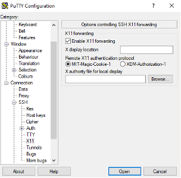
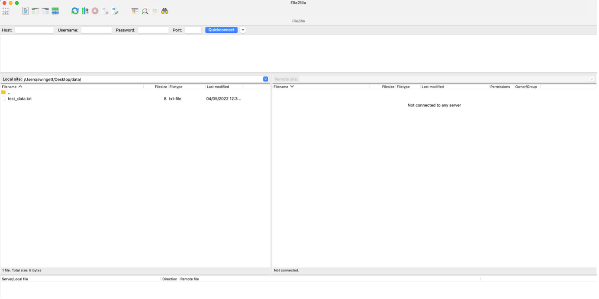

# LMB Bioinformatics:Running NGS Pipelines
### How to run NGS bioinformatics pipelines using Nextflow on the LMB compute cluster

---

# Part I
## Getting started on the cluster (hours 1-4)

---

## Course aims
* Learn to use the LMB compute cluster
* Introduction to analysing next-generation sequencing (NGS) data
* Learn about bioinformatics pipelines
* Run Nextflow & nf-core

---

## Prerequisites
* You will need to be registered to gain access to the cluster 

* Windows systems software:
    * FileZilla Client - https://filezilla-project.org
    * Putty: https://www.chiark.greenend.org.uk/~sgtatham/putty/latest.html

* macOS software:
    * FileZilla Client - https://filezilla-project.org
  
---

# Cluster Computing
## What it is and how to access the LMB cluster 

---

## What is a compute cluster?

---

## LMB compute cluster specifications
* 130 nodes (on CPU partition)
* 754 GB RAM
* 112 (HT) cores
* 14,560 usable cores
* **Simply put, 14,560 processes that can be run in parallel**

---

## LMB compute cluster specifications
* Huge data storage (cephf2: 7.1PB)
* (Almost) never turned off
* Specialist software manages long-running jobs
* Compute cluster needed for modern life sciences datasets

---

## Accessing the cluster - Mac
* On a Mac open the terminal to connect to head node  (either hal, hex or max): 
`ssh –Y username@hal`
* Enter your cluster password 
* Connect to **atg** first if connecting from outside

---

## Accessing the cluster - PC
* On a PC, open Putty and connect to the head node  (either hal, hex or max):
`username@hal`

* Connect to atg first if connecting from outside

---

## Accessing the cluster - PC (2)

---

## Transferring files

* FileZilla Client: https://filezilla-project.org 
* Free and available for Windows and macOS
* Normal logon credentials, and 
  Host: `hal`
  Port: `22`

---

## Transferring files (2)

---

## Exercise 1

---

## Getting to grips with Linux
### Introducing the command line

---

## Getting to grips with Linux
* Similar to Windows and macOS, Linux is an operating system
* Free and open source
* Different types of Linux e.g. Android
* The LMB cluster uses AlmaLinux
* Big difference : you need to use the command line
* Not so intuitive, but more powerful

---
 ## The Bash Shell

 * Shells – command line interface interpreter programs
 
 * We recommend using Bash - arguably the best known
 
 * This is not the LMB cluster default – so let’s change it now:
  `cp ~admin/{.bashrc,.profile} $HOME`
  `ypchsh`
 * Specify the bash shell: /bin/bash
 * Log out (exit) and then log in again
 * You only need to do this once
 
---

## Introducing Linux commands
* Each command is actually a program
* Modified by flags, options and arguments

      command [-flag(s)] [-option(s) [value]] [argument(s)]

---

## Introducing Linux commands – (`ls`)

    ls
    directory1  file1.txt  file2.txt  file3.txt

---
## Introducing Linux commands – (`ls` with flag)
 

`command [-flag(s)]`

 

    ls –l

    total 12
    drwxrwxr-x 2 swingett swingett 4096 Jul 15 15:59 directory1
    -rw-rw-r-- 1 swingett swingett    0 Jul 15 15:57 file1.txt
    -rw-rw-r-- 1 swingett swingett   17 Jul 15 16:35 file2.txt
    -rw-rw-r-- 1 swingett swingett   37 Jul 15 16:34 file3.txt

---

## Introducing Linux commands – (`ls` with flags)
 

`command [-flag(s)]`

 

    ls -l --human-readable

    total 12K
    drwxrwxr-x 2 swingett swingett 4.0K Jul 15 15:59 directory1
    -rw-rw-r-- 1 swingett swingett    0 Jul 15 15:57 file1.txt
    -rw-rw-r-- 1 swingett swingett   17 Jul 15 16:35 file2.txt
    -rw-rw-r-- 1 swingett swingett   37 Jul 15 16:34 file3.txt

---

## Introducing Linux commands – (`ls` with flags)
 

`command [-flag(s)]`

 

    ls –l -h

    total 12K
    drwxrwxr-x 2 swingett swingett 4.0K Jul 15 15:59 directory1
    -rw-rw-r-- 1 swingett swingett    0 Jul 15 15:57 file1.txt
    -rw-rw-r-- 1 swingett swingett   17 Jul 15 16:35 file2.txt
    -rw-rw-r-- 1 swingett swingett   37 Jul 15 16:34 file3.txt

---

## Introducing Linux commands – (`ls` with flags)
 

`command [-flag(s)]`

 

    ls –lh

    total 12K
    drwxrwxr-x 2 swingett swingett 4.0K Jul 15 15:59 directory1
    -rw-rw-r-- 1 swingett swingett    0 Jul 15 15:57 file1.txt
    -rw-rw-r-- 1 swingett swingett   17 Jul 15 16:35 file2.txt
    -rw-rw-r-- 1 swingett swingett   37 Jul 15 16:34 file3.txt

---

## Introducing Linux commands – (`ls` with option)
 

`command [-flag(s)] [-option(s) [value]]`

 

    ls -l --sort=size

    total 12
    drwxrwxr-x 2 swingett swingett 4096 Jul 15 15:59 directory1
    -rw-rw-r-- 1 swingett swingett   37 Jul 15 16:34 file3.txt
    -rw-rw-r-- 1 swingett swingett   17 Jul 15 16:35 file2.txt
    -rw-rw-r-- 1 swingett swingett    0 Jul 15 15:57 file1.txt

---

## Introducing Linux commands – (`ls` with argument)
 

`command [-flag(s)] [-option(s) [value]] [argument(s)]`

 

    ls -l file2.txt file3.txt

    -rw-rw-r-- 1 swingett swingett 17 Jul 15 16:35 file2.txt
    -rw-rw-r-- 1 swingett swingett 37 Jul 15 16:34 file3.txt

---

## Demo Linux commands and the filesystem

    ls
    pwd
    cd 
    cp
    mv
    mkdir
    rmdir
    rm
    history

---

## Introducing the Linux filesystem
* Locations represented as a line of text

* Each folder ends with a forward slash:
  `/lmb/home/jsmith/file1.txt`

* Relative links:
  `../pjones/file2.txt`
  `./file4.txt` 
  `~/folderA/file5.txt`

---

## Naming files

*  Use only alphanumeric characters, the underscore symbol (_) and the dot (.):
`my_file1.txt`

* **Not spaces!**

* File extension can tell you what a file is

* Hidden files:
  `.hidden_file.log`

---

## Exercise 2

---

## Demo the Reading and writing files

    cat
    head
    tail
    more
    nano
    gzip
    zcat
    gunzip

---

## Exercise 3

---

## Redirects (`>` `>>`)

* Redirect to a file:
`cat file1.txt > file1_copy.txt`
`cat file1.txt file2.txt file3.txt > combined.txt`

* Append to a file:
`cat file4.txt >> combined.txt`

Can use redirects with other command (i.e. not just `cat`)

---

## Pipes (`|`)

* Takes output from one command and pass to another:
`zcat file.txt.gz | more`

---

## `grep`

* Search text files

* Return lines in a text file where search term is found:
  `grep organoid thesis.txt`

---

## Wildcards

* Represent symbolically other characters

* Example: `england.txt`, `northern_ireland.txt`, `scotland.txt`, `wales.txt`

* Asterisk matches none or more characters: 
        
      ls *land.txt
      england.txt  northern_ireland.txt  scotland.txt

* Question mark matches exactly one character:
 
      ls wa?es.txt
      wales.txt

---

## Wildcards 2

* Character class matches any of the single alphanumeric characters in the list:

      ls [es]*.txt
      england.txt  scotland.txt

---

## Links to files

* Symbolic links akin to shortcuts on Windows and aliases on macOS

* Link to a single file:
`ln -s /target_folder/target_file_of_interest.txt`

* Link to a single file, except link has a different name:
`ln -s /target_folder/target_file_of_interest.txt link.txt`

* Links to multiple files:
`ln -s /target_folder/*.txt .`

---

## Getting help

* Simple description: whatis

* Detailed manual: man

* Google, ChatGPT

* Forums
  
* Cheat sheet

---

## Exercise 4

---

## File permissions

 

| Column | Description (`ls -l`)                             |
|--------|---------------------------------------------------|
| 1      | File type (- file / d directory / l link)         |
| 2      | Permission string (owner / group /everyone) (rwx) |
| 3      | Number of hard links                              |
| 4      | Owner name                                        |
| 5      | Owner group                                       |
| 6      | File size in bytes                                |
| 7      | Modification time                                 |
| 8      | File name                                         |

---

## Other useful points

* Variables (e.g. `$USER`) – built-in and user-defined

* Display to screen using `echo`

* Order lines with `sort`

* Transfer data with `curl`

* Fix line endings with `dos2unix` and `mac2unix`

---

## Running commands

* `$PATH`
  `/usr/bin:/usr/local/sbin:/usr/sbin`

* `which`
    `which ls`
    `/usr/bin/ls`

* `ps` / `top`

* `nohup` (no hang up)

* Backgrounding with `&`

---

## Running commands 2

* Cancel job with <kbd>CTRL</kbd> + <kbd>C</kbd>

* Suspend with <kbd>CTRL</kbd> + <kbd>Z</kbd> / `bg` (`fg` will foreground a job)

* `kill [job id]`

* `kill -9 [job id]`

---

## Exercise 5

---

## Part 1 - Recap
* Cluster architecture
* Logging in to the cluster
* Using Linux and command line shells
* BASH 
* Navigating
* Copying; deleting; moving; linking files
* Reading; writing; searching files 
* Compressing data
* Re-direction, appending, piping
* Wildcards

---

## Part 1 - Recap (2)
* File permissions
* Downloading
* Variables
* Running programs
* Checking running programs (ps, top)
* `$PATH`
* Running in the background (`&`, `bg`, `nohup`)
* Where to get help

---

## Part 2
### Introducing Next Generation Sequencing and SLURM (hours 5 – 8)

---

## Next generation sequencing
### What it is, its applications and data types

---

## Next generation sequencing

* Next-generation sequencing (NGS) is a massively parallel sequencing technology

* Illumina platform most commonly used – very high throughput

* PacBio or Oxford Nanopore – longer reads but less throughput

---

## Common types of analysis
* whole-genome sequencing
* exome sequencing
* targeted gene sequencing
* single-cell profiling
* RNA-seq
* ChIP-seq
* ATAC-seq
* methylation sequencing 	  	
* metagenomic profiling	 	
* chromosome capture sequencing (e.g. HiC)

---

## Equipment

|                          | iSeq 100 | MiniSeq | MiSeq Series | NextSeq 550 Series | NextSeq 1000 & 2000 | NovaSeq 6000 |
|--------------------------|----------|---------|--------------|--------------------|---------------------|--------------|
| Run Time (hours)         | 9.5–19   | 4–24    | 4–55	       | 12–30	            | 11-48	              | 13-44        |
| Maximum Output (Gb)	     | 1.2	    | 7.5	    | 15	         | 120	              | 330	                | 6000         |
| Maximum Reads	           | 4M       | 25M     | 25M	         | 400M		            | 1.1B                |	20B          |
| Maximum Read Length	(bp) | 2×150	  | 2×150   | 2×300        | 2×150              | 2×150               | 2 x 250      |

---

  

##### Illumina sequencing process - cluster generation
* Flowcell
* Lanes
* Oligo lawn
* Bridge amplification
  
 *(Image courtesy of Abizar, Wikipedia)* 
  
---

##### Illumina sequencing process - sequencing by synthesis

 

* Fluorescent tag 

* Reversible terminator

* Record colour of fluorescent emissions 

*(Image courtesy of courtesy of DMLapato, Wikipedia)*

---
