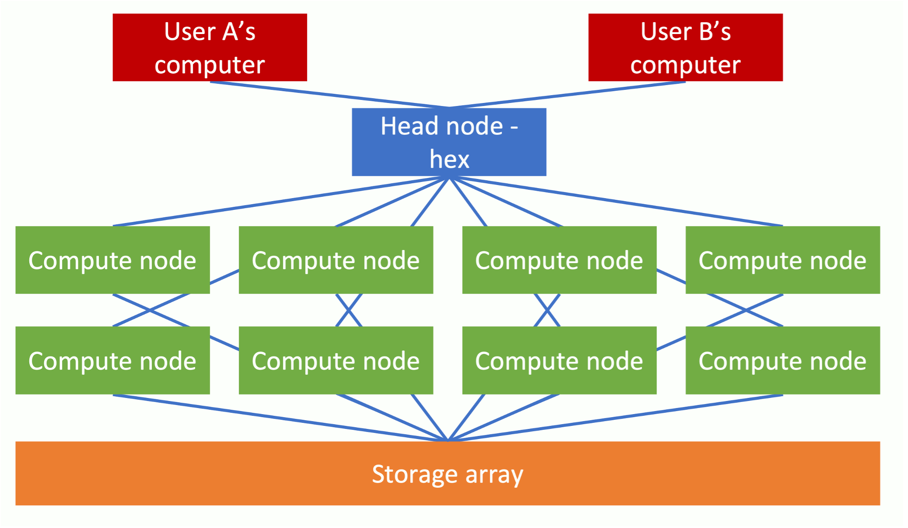
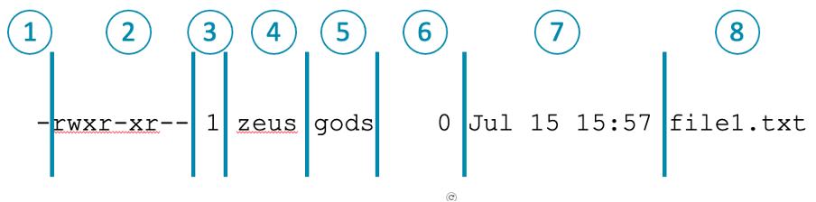

# Running Bioinformatics Software on a Linux Computer Cluster

---

## Course aims
* Understanding the Computer Cluster setup
* Learning command line Linux
* Navigating the cluster
* Submitting cluster jobs

---

## Prerequisites
* You will need to be registered to gain access to the cluster 

* Windows systems software:
    * FileZilla Client - https://filezilla-project.org
    * Putty: https://www.chiark.greenend.org.uk/~sgtatham/putty/latest.html

* macOS software:
    * FileZilla Client - https://filezilla-project.org
  
---

# Part I
## Getting started on the cluster (hours 1-4)

---

# Cluster Computing
## What it is and how to access the LMB cluster 

---

## What is a compute cluster?

---

## LMB compute cluster specifications
* 130 nodes (on CPU partition)
* 754 GB RAM
* 112 (HT) cores
* 14,560 usable cores
* **Simply put, 14,560 processes that can be run in parallel**

---

## LMB compute cluster specifications
* Huge data storage (`/cephfs2`: 7.1PB)
* (Almost) never turned off
* Specialist software manages long-running jobs
* Compute cluster needed for modern life sciences datasets
* Maintained by **Scientific Computing**

---

## Accessing the cluster - Mac
* On a Mac open the terminal to connect to head node  (either hal, hex or max): 
`ssh –Y username@hal`
* Enter your cluster password 
* Connect to **atg** first if connecting from outside

---

## Accessing the cluster - PC
* On a PC, open Putty and connect to the head node  (either hal, hex or max):
`username@hal`

* Connect to atg first if connecting from outside

---

## Accessing the cluster - PC (2)

---

## Transferring files

* FileZilla Client: https://filezilla-project.org 
* Free and available for Windows and macOS
* Normal logon credentials, and 
  Host: `hal`
  Port: `22`

---

## Transferring files (2)

---

## Cell Biology Bioinformatics Machine - Xeon

* Analogous to a single cluster node
  
* 21TB of data storage, 80CPUs and 97GB RAM  

* Maintained by the Cell Biology Division

* Software can be installed as per users' requirements

---

## Cell Biology Bioinformatics Machine - Xeon (2)

* Let us know if you would like an account (and you are a memember of the Cell Biology Division)

*  `sean-pc-10.lmb.internal` 

*  **NOT BACKED UP!!!**

---

## Exercise 1

---

## Getting to grips with Linux
### Introducing the command line

---

## Getting to grips with Linux
* Similar to Windows and macOS, Linux is an operating system
* Free and open source
* Different types of Linux e.g. Android
* The LMB cluster uses AlmaLinux
* Big difference : you need to use the command line
* Not so intuitive, but more powerful

---
 ## The Bash Shell

 * Shells – command line interface interpreter programs
 
 * We recommend using Bash - arguably the best known
 
 * This is not the LMB cluster default

 * Ask scientific computing to make it your default
  
 * Otherwise, temporarily specify the bash shell with: `bash`
 
---

## Introducing Linux commands
* Each command is actually a program
* Modified by flags, options and arguments

      command [-flag(s)] [-option(s) [value]] [argument(s)]

---

## Introducing Linux commands – (`ls`)

    ls
    directory1  file1.txt  file2.txt  file3.txt

---
## Introducing Linux commands – (`ls` with flag)
 

`command [-flag(s)]`

 

    ls –l

    total 12
    drwxrwxr-x 2 swingett swingett 4096 Jul 15 15:59 directory1
    -rw-rw-r-- 1 swingett swingett    0 Jul 15 15:57 file1.txt
    -rw-rw-r-- 1 swingett swingett   17 Jul 15 16:35 file2.txt
    -rw-rw-r-- 1 swingett swingett   37 Jul 15 16:34 file3.txt

---

## Introducing Linux commands – (`ls` with flags)
 

`command [-flag(s)]`

 

    ls -l --human-readable

    total 12K
    drwxrwxr-x 2 swingett swingett 4.0K Jul 15 15:59 directory1
    -rw-rw-r-- 1 swingett swingett    0 Jul 15 15:57 file1.txt
    -rw-rw-r-- 1 swingett swingett   17 Jul 15 16:35 file2.txt
    -rw-rw-r-- 1 swingett swingett   37 Jul 15 16:34 file3.txt

---

## Introducing Linux commands – (`ls` with flags)
 

`command [-flag(s)]`

 

    ls –l -h

    total 12K
    drwxrwxr-x 2 swingett swingett 4.0K Jul 15 15:59 directory1
    -rw-rw-r-- 1 swingett swingett    0 Jul 15 15:57 file1.txt
    -rw-rw-r-- 1 swingett swingett   17 Jul 15 16:35 file2.txt
    -rw-rw-r-- 1 swingett swingett   37 Jul 15 16:34 file3.txt

---

## Introducing Linux commands – (`ls` with flags)
 

`command [-flag(s)]`

 

    ls –lh

    total 12K
    drwxrwxr-x 2 swingett swingett 4.0K Jul 15 15:59 directory1
    -rw-rw-r-- 1 swingett swingett    0 Jul 15 15:57 file1.txt
    -rw-rw-r-- 1 swingett swingett   17 Jul 15 16:35 file2.txt
    -rw-rw-r-- 1 swingett swingett   37 Jul 15 16:34 file3.txt

---

## Introducing Linux commands – (`ls` with option)
 

`command [-flag(s)] [-option(s) [value]]`

 

    ls -l --sort=size

    total 12
    drwxrwxr-x 2 swingett swingett 4096 Jul 15 15:59 directory1
    -rw-rw-r-- 1 swingett swingett   37 Jul 15 16:34 file3.txt
    -rw-rw-r-- 1 swingett swingett   17 Jul 15 16:35 file2.txt
    -rw-rw-r-- 1 swingett swingett    0 Jul 15 15:57 file1.txt

---

## Introducing Linux commands – (`ls` with argument)
 

`command [-flag(s)] [-option(s) [value]] [argument(s)]`

 

    ls -l file2.txt file3.txt

    -rw-rw-r-- 1 swingett swingett 17 Jul 15 16:35 file2.txt
    -rw-rw-r-- 1 swingett swingett 37 Jul 15 16:34 file3.txt

---

## Demo Linux commands and the filesystem

    ls
    pwd
    cd 
    cp
    mv
    mkdir
    rmdir
    rm
    history

---

## Introducing the Linux filesystem
* Locations represented as a line of text

* Each folder ends with a forward slash:
  `/lmb/home/jsmith/file1.txt`

* Relative links:
  `../pjones/file2.txt`
  `./file4.txt` 
  `~/folderA/file5.txt`

---

## Naming files

*  Use only alphanumeric characters, the underscore symbol (_) and the dot (.):
`my_file1.txt`

* **Not spaces!**

* File extension can tell you what a file is

* Hidden files:
  `.hidden_file.log`

---

## Exercise 2

---

## Demo the Reading and writing files

    cat
    head
    tail
    more
    nano
    gzip
    zcat
    gunzip

---

## Exercise 3

---

## Redirects (`>` `>>`)

* Redirect to a file:
`cat file1.txt > file1_copy.txt`
`cat file1.txt file2.txt file3.txt > combined.txt`

* Append to a file:
`cat file4.txt >> combined.txt`

Can use redirects with other command (i.e. not just `cat`)

---

## Pipes (`|`)

* Takes output from one command and pass to another:
`zcat file.txt.gz | more`

---

## `grep`

* Search text files

* Return lines in a text file where search term is found:
  `grep organoid thesis.txt`

---

## Wildcards

* Represent symbolically other characters

* Example: `england.txt`, `northern_ireland.txt`, `scotland.txt`, `wales.txt`

* Asterisk matches none or more characters: 
        
      ls *land.txt
      england.txt  northern_ireland.txt  scotland.txt

* Question mark matches exactly one character:
 
      ls wa?es.txt
      wales.txt

---

## Wildcards 2

* Character class matches any of the single alphanumeric characters in the list:

      ls [es]*.txt
      england.txt  scotland.txt

---

## Links to files

* Symbolic links akin to shortcuts on Windows and aliases on macOS

* Link to a single file:
`ln -s /target_folder/target_file_of_interest.txt`

---

## Links to files 2

* Link to a single file, except link has a different name:
`ln -s /target_folder/target_file_of_interest.txt link.txt`

* Links to multiple files:
`ln -s /target_folder/*.txt .`

---

## Getting help

* Simple description: `whatis`

* Detailed manual: `man`

* Google, ChatGPT

* Forums
  
* Cheat sheet

---

## Exercise 4

---

## File permissions

 

| Column | Description (`ls -l`)                             |
|--------|---------------------------------------------------|
| 1      | File type (- file / d directory / l link)         |
| 2      | Permission string (owner / group /everyone) (rwx) |
| 3      | Number of hard links                              |
| 4      | Owner name                                        |
| 5      | Owner group                                       |
| 6      | File size in bytes                                |
| 7      | Modification time                                 |
| 8      | File name                                         |

---

## File permissions (2)

* Add execute privileges for user: `chmod u+x [files]`
  
* Add write privileges for group: `chmod g+w [files]`

* Remove read privileges for others: `chmod o-r [files]`

* Add read privileges for everyone: `chmod a+r [files]`

* There is also a "numerical" system to do this

---

## Other useful points

* Variables (e.g. `$USER`) – built-in and user-defined

* Display to screen using `echo`

* Order lines with `sort`

* Transfer data with `curl`

* Fix line endings with `dos2unix` and `mac2unix`

---

## Running commands

* `$PATH`
  `/usr/bin:/usr/local/sbin:/usr/sbin`

* `which`
    `which ls`
    `/usr/bin/ls`

* `ps` / `top`

* `nohup` (no hang up)

* Backgrounding with `&`

---

## Running commands 2

* Cancel job with <kbd>CTRL</kbd> + <kbd>C</kbd>

* Suspend with <kbd>CTRL</kbd> + <kbd>Z</kbd> / `bg` (`fg` will foreground a job)

* `kill [job id]`

* `kill -9 [job id]`

---

## Exercise 5

---

## Part 1 - Recap
* Cluster architecture
* Logging in to the cluster
* Using Linux and command line shells
* BASH 
* Navigating
* Copying; deleting; moving; linking files
* Reading; writing; searching files 
* Compressing data
* Re-direction, appending, piping
* Wildcards

---

## Part 1 - Recap (2)
* File permissions
* Downloading
* Variables
* Running programs
* Checking running programs (`ps`, `top`)
* `$PATH`
* Running in the background (`&`, `bg`, `nohup`)
* Where to get help

---

# Part II
## Using the Cluter Compute Nodes (hours 4-8)

---

## Let's use compute nodes

---

## Slurm

* Clusters require job management and scheduling system

* Keeps the nodes all in contact with one another etc.

* LMB cluster uses Slurm (updated recently)

---

## Using Slurm (2)

* Slurm is open-source software for large and small Linux clusters

* Uses the command line

* `man` pages are available

---

## Slurm – checking status [demo]

* `squeue`

* `squeue -u $USER`

 

---

## Slurm – checking status (2) [demo]
* `sqsummary` – CPU node state

* `sinfo` – partition node information

* `qinfo` – interactive webpage: http://nagios2/qinfo/

---

## Interactive vs submitted jobs
* Interactive jobs: run short operations that complete quickly while you wait, then check the results and perform another calculation if required

* Submitted jobs: long-running jobs that do not require user intervention

---

## Interactive jobs [demo]
* Move to a compute node 
  
* `srun --pty bash`
  
* Prompt change: `username@fmb376`

* There are options: `srun -c 8 --pty bash`

---

## Submitted jobs [demo]

* Job runs without further user input

* Write Bash script:
  
      #!/bin/bash
      echo Sleeping!
      sleep 100

* Execute script:
  
      bash test.sh
      Sleeping

---

## Submitted jobs (2) [demo]

* Submit script to queue:
  `sbatch test.sh`

---

## Submitted jobs (3)

* More options:

      sbatch -J test_job -c 2 --mail-type=ALL --mail-user=$USER@mrc-lmb.cam.ac.uk --mem=2G test.sh

  

| Command                             | Function                                                      |
|-------------------------------------|---------------------------------------------------------------|
| -J [jobname]                        | Specify an easily identifiable jobname                        |
| -c [number of cores]                | Number of cores on a node to reserve for the job [default: 1] |
| --mem=[RAM]G                        | GB of RAM to reserve for the job [default: 5]                 |
| --mail-type=ALL                     | Send email updates on job progress                            |
| --mail-user=$USER@mrc-lmb.cam.ac.uk | Recipient’s email address                                     |

---

## Submitted jobs (4) [demo]

* `sacct -j [job id]`

* To get the maximum memory usage:
  
      sacct --format=jobID%20,CPUTime,MaxRSS -j [job id]

* `scancel [job id]`

---

## Modules [demo]

* Import specific software versions

* To list available module:

  `module avail`

* To use a module:
  `module load [module name]`

---

# Additional points

* Exit codes – 0 means success!

* View images requires XQuartz (Mac) or VcXsrv (Windows)

* Not so responsive – maybe transfer to local machine first?

* More details:
   https://www.mrc-lmb.cam.ac.uk/scicomp

---

## Exercise 6
### Using the cluster “as a cluster”

---

## Where to put data (Cluster)

* `~` (home directory) -  config files and scripts

* `/cephfs` & `/cephfs2` - very large data storage / suitable location for processing data.

* `/scratch` - suitable location for processing data, **BUT FILES ARE AUTOMATICALLY DELETED - DON'T STORE FILES HERE!**  

* `/istore` or `/isilon` - a place to store data

**Refer to Scientific Computing for further information**

---

## Where to put data (Cell Biology Xeon)

* `~` (home directory) -  config files and scripts

* Create a named folder in `/data1`, `/data2` or `/data3/scratch` to store data files

* Much smaller storage compacity as compared to the Cluster (terrabytes)

---
## Transferring Files (SCP)

* To/From the cluster To/From another machine via the **intranet**
        
* `scp user@host:[target_to_download] [destination_path]`  
  
* `scp [target_to_upload] user@host:[destination_path]`

* Perform a **recursive copy** for folders: `-r`

---
## Transferring Files (SFTP/FTP)

* To/From the cluster To/From another machine via the *internet*

* Linux command line equivalent of FileZilla

* `sftp [hostname]`

* `mget -r [files_to_download]`

* `mput -r [files_to_download]`

---

## Transferring Files (SFTP/FTP) (2)

* `ftp [hostname]`

* `bin`

* `prompt`

* LMB FTP: `/ftp/pub/`
  
* LMB FTP: `ftp.mrc-lmb.cam.ac.uk`

* 'anonymous' with no password

---

## Screen

* Interactive, but run in background (needed for SFTP)

* `screen -S [screen_name]`

* <kbd>CTRL</kbd> + <kbd>A</kbd> and then press <kbd>D</kbd>

* `screen -ls`

* `screen -r [ID_number]`

* `exit`
  
---

## Visual Studio Code [demo] 
  * Microsoft Text editor
  * Windows / Mac / Linux
  * Edit remote files (even via atg)
  * Built-in terminal
  * View webpages
  * Transfer files
  * Free
  
---

## Visual Studio Code (2) [demo]

* https://code.visualstudio.com

  
---  

## R Studio Server

* Web interface

* http://hal:8788

* http://sean-pc-10.lmb.internal:8787

---

## Jupyter Hub Server
* Jupyter Notebook - create and share documents that contain live code, equations, plots and descriptive text

---

## Jupyter Hub Server (2)
* Not supported on the Cluster

* Installed on the Cell Biology Workstation (Xeon)

* We can set you up with an account

* Course: https://github.com/StevenWingett/data-analysis-with-python-course

---

## Software locations 
* `/public/genomics/soft/bin`
  
* Add to PATH?

* `software` group 
  
---

## Singularity containers
* Enable software and dependencies to be bundled into one file  
  
*  most effective way to distribute versioned bioinformatics software 

* On the cluster, containers can only be run from:  `/public/singularity/`.

* Add files to that folder: `singularity` group 

* Also installed on Xeon, where containers can be run from any location

---

## Summary

* Linux / Bash

* Cell Biolgy Xeon Workstation

* Compute cluster and its architecture

* Slurm

* R Studio Server / JupyterHub / Visual Studio Code

* Find a reason to have a go in the coming weeks

* Thanks for listening!!!
